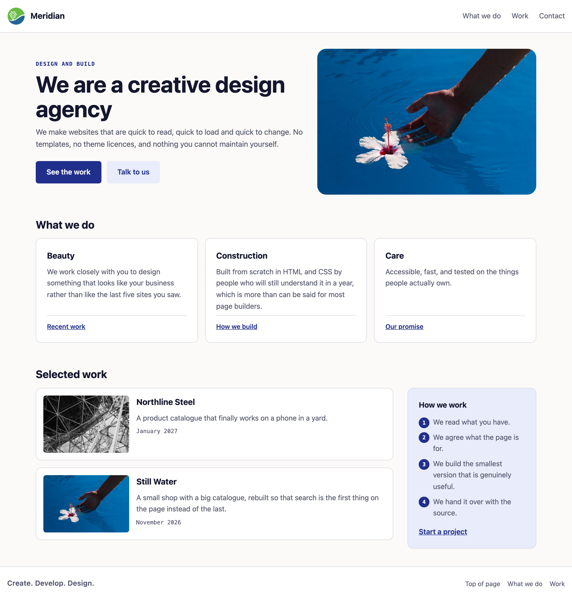
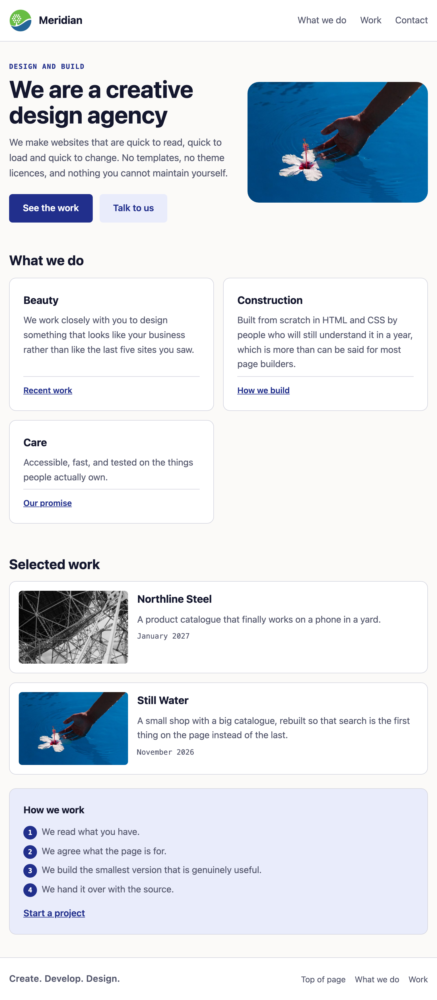
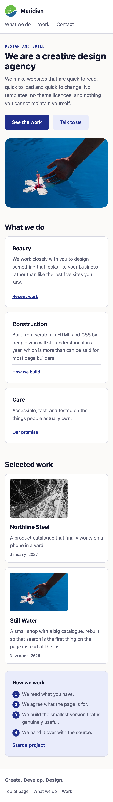

> [!goal]
> לקבל עמוד אמיתי גמור, שלושה צילומי מסך של איך הוא צריך להיראות, וגיליון סגנון ריק —
> **ולבנות את הפריסה מחדש**, mobile-first, ב-Grid ו-Flexbox.

במטלת הבית הראשונה בנית אתר משלך מאפס. הפעם ההפך: מישהו אחר כתב את התוכן ואת המבנה,
ואתה מקבל תמונה של איך זה אמור להיראות. **זו העבודה האמיתית.** רוב הקוד שתכתוב בחיים
יהיה בתוך משהו שכבר קיים.

## תוצרי למידה

בסיום המטלה תדע:

1. לקרוא פריסה מצילום מסך ולפרק אותה לאזורים לפני שאתה כותב שורה.
2. לבנות שלד עמוד שלם ב-Grid, כולל כותרת תחתונה שיורדת לתחתית בעמוד קצר.
3. להחליט, אזור אחרי אזור, אם זה Grid או Flexbox — ולנמק.
4. לבחור שתי נקודות שבירה מהתוכן ולכתוב הכול mobile-first.
5. לתחזק `srcset` ו-`sizes` **אחרי** שהפריסה שמסביבם השתנתה.
   (`srcset="a.jpg 480w, b.jpg 960w"` — הקבצים והרוחב של כל אחד; `sizes="(min-width: 60em) 40vw, 100vw"` — כמה רחבה התמונה תוצג: 40% מהחלון במסך רחב, כולו אחרת. הדפדפן בוחר קובץ לפי שניהם; הם ניתנים לך בקובץ, ואתה לא כותב אותם מאפס.)
6. להוסיף מקטע משלך לעמוד קיים בלי לשבור אותו.

## מה בדיוק אתה בונה

תיקייה `homework/hw-2/` במאגר הסמסטר שלך, ובה:

| קובץ | מה זה |
|---|---|
| `index.html` | **גמור. אל תיגע בו** — חוץ ממקום אחד מסומן, בשכבת ההרחבה |
| `styles.css` | הקובץ שאתה כותב |
| `images/` | התמונות, בשלושה גדלים, ושלושת צילומי המטרה |
| `README.md` | אתה כותב: לפחות שורה אחת שאומרת מה יש בתיקייה |

והמאגר עצמו נבדק (ידנית, 3 נקודות): הקבצים ב-`homework/hw-2/`, **לפחות שלושה קומיטים** עם הודעות
שאומרות מה נעשה, ובלי `node_modules` ו-`.DS_Store`.

> [!note] מאיפה העמוד הזה הגיע
> זה תרגיל **Agency** מהקורס הקודם, בנוי מחדש. המקור השתמש ב-`float: left` ו-`float: right`
> בשביל שתי עמודות, בתמונה צפה בשביל עטיפת טקסט, ב-`min-height: 95vh` בשביל כותרת תחתונה
> דביקה, ובשאילתת `@media (max-width: 680px)` אחת.
>
> **כל אחד מהם הוא משהו ששבועות 4 ו-5 מלמדים נגדו**, וזו הסיבה שזו בנייה מחדש ולא שינוי
> צבעים. במקומם: Grid, `aspect-ratio` עם `object-fit`, שורת `1fr` בשלד, ושתי שאילתות
> `min-width`.

## איך זה אמור להיראות בסוף







**הסתכל בשלושתם לפי הסדר לפני שאתה כותב שורה.** זה אותו עמוד בכל פעם — שום דבר לא מופיע
ושום דבר לא נעלם. רק הסידור משתנה.

## המשימה, שלב אחר שלב

הסעיפים ממוספרים ב-`styles.css` באותו סדר, וכל מקום שבו אתה כותב מסומן `CODE HERE`. כל סימון `CODE HERE` של הליבה חייב להיעלם; סימון שבשורה שלו כתוב גם שם השכבה בסוגריים מסולסלים (`stretch`, `challenge` או `optional`) מותר להשאיר אם דילגת על החלק הזה.

1. **שלד העמוד** {core} — שלוש שורות, וכותרת תחתונה שמגיעה לתחתית החלון גם בעמוד קצר.
   יש דרך מדויקת לעשות את זה, והיא לא אחוז מגובה המסך.
   הקלדת אותה בשבוע 5, במחזור 5, בבלוק ה-`64em`: `min-height: 100dvh` על המסגרת ו-`grid-template-rows: auto 1fr auto` — שורת התוכן היא `1fr`.
2. **הכותרת העליונה** {core} — מותג בצד אחד, ניווט בשני, נשבר לשורות בנייד.
3. **ה-hero** {core} — נערם בנייד, שתי עמודות במסך רחב, כותרת שזורמת עם הרוחב.
4. **שורת הכרטיסים** {core} — משנה מספר עמודות לבד, **בלי שאילתת מדיה**.
5. **רשימת העבודות והסרגל** {core} — נערמים בנייד, זה לצד זה במסך רחב.
6. **הכותרת התחתונה** {core}.
7. **מקטע משלך** {stretch} — HTML **וגם** CSS. יש מקום מסומן ב-`index.html`, וזה המקום
   היחיד בקובץ הזה שמותר לך לגעת בו. הצעות: שורת צוות, טבלת מחירים, המלצות, טופס יצירת
   קשר (עם `label`, כמו בשבוע 2).
8. **ליטוש** {stretch} — מצבי `hover`, בלי תכונות שמאלצות פריסה: `transform` ו-`opacity` עדיפים; צבע
   וצל מותרים — בלי פריסה, אבל צביעה מחדש בכל פריים, אז רק ל-hover קצר.

> [!constraints]
> - **בלי `@media (max-width: …)`.** כל שאילתת רוחב היא `min-width`.
> - **בלי `float` לפריסה.** זה מה שאתה מחליף.
> - **בלי גובה קבוע** על אזור פריסה.
> - **בלי גלילה אופקית** ב-375, ב-768 וב-1280. הבודק מודד את זה בשלושת הרוחבים.
> - בלי Tailwind (שבוע 6) ובלי JavaScript.
> - בלי `transition` על `width`, `height`, מיקום, שוליים או `transition: all` — וגם לא משך
>   בלי תכונה: `transition: 200ms` הוא `all 200ms`.
>   נופלים תמיד: `all` שכתוב במפורש, `transition` עם משך ובלי תכונה, ותכונה שמאלצת פריסה — בכל תנאי ובכל מצב, חוץ מבתוך `@media (prefers-reduced-motion: reduce)` עם משך של 10ms ומטה, שזה כיבוי תנועה; צורה שהבודק לא יכול להכריע בוודאות (למשל `var()` עם יותר מדי צירופים) מקבלת את הספק לטובתך, ועשויה להיבדק ידנית.
> - בלי `!important`.
> - אל תיגע ב-`index.html` חוץ מהמקום המסומן.

> [!note]
> **הגוון שלך.** בראש `styles.css` יש `--hue-brand`, ומותר לשנות אותו — בחירת הגוון לא נבדקת.
> אבל ניגודיות כן נבדקת (axe, בשורה "נקי ונגיש"): אחרי שהחלפת גוון, בדוק את ה-`.kicker` ואת
> הכפתורים בבורר הצבע של Chrome (שבוע 3, מחזור 3) — צריך 4.5 לפחות. בגוונים צהובים, ירוקים
> ותכלת (בערך 45 עד 185) זה לא יעבור כמו שהוא: הורד את הבהירות של `--color-accent` (המספר
> השלישי, 34%) עד שזה עובר — בערך 28% עד 32%.

## פירוט הניקוד

| רכיב | מה נבדק | ניקוד | סוג בדיקה |
|---|---|---|---|
| גיליון סגנון | מקושר ונטען | 3 | אוטומטי |
| שלד העמוד | שלוש שורות, כותרת תחתונה בתחתית בעמוד קצר | 8 | אוטומטי |
| כותרת עליונה | שני צדדים, נשברת בנייד | 5 | אוטומטי |
| ה-hero | נערם ב-375, שתי עמודות ב-1280 | 10 | אוטומטי |
| שורת הכרטיסים | משנה עמודות לבד | 8 | אוטומטי |
| עבודות וסרגל | נערמים ואז זה לצד זה | 8 | אוטומטי |
| mobile-first | הכול min-width, שתי נקודות שבירה | 6 | אוטומטי |
| מגבלות | בלי float, בלי גובה קבוע, בלי `!important`, בלי סימוני ליבה, בלי גלילה אופקית, HTML תקין | 4 | אוטומטי |
| נאמנות וגימור | דומה לצילום במבנה, קצב, נשימה | 10 | ידני |
| איכות הקוד | **Grid לפריסה, Flex לרכיבים**, קריאוּת, הערות | 5 | ידני |
| מאגר ו-README | הקבצים ב-`homework/hw-2/`, לפחות שלושה קומיטים, שורה ב-README | 3 | ידני |
| התמונות | `aspect-ratio` מוגדר — היחס בחירה שלך — ואותה צורה ב-375 וב-1280; ו-`object-fit`, בלי עיוות | 8 | אוטומטי |
| כותרת זורמת | משתנה בין 375 ל-1280 | 4 | אוטומטי |
| מקטע משלך | קיים, עם כותרת, לא שובר | 5 | אוטומטי |
| תנועה בלי פריסה | מעברים רק על תכונות שלא מאלצות פריסה | 3 | אוטומטי |
| תמונות רספונסיביות | `srcset` ו-`sizes` שרדו את הבנייה מחדש | 4 | אוטומטי |
| פריט עבודה | תמונה לצד טקסט, תאריך בתחתית | 3 | אוטומטי |
| נקי ונגיש | אפס שגיאות, אפס הפרות axe | 3 | אוטומטי |

ליבה 70 · הרחבה 20 · אתגר 10.

```bash
node .checks/run-checks.mjs
```

**ירוק זה הרצפה, לא הציון.**

> [!ai-policy]
> **שבוע 5 — Claude במצב מורה פרטי.** מותר להסביר, לצייר ולבדוק. אתה מקליד כל תו.
>
> ושים לב במיוחד הפעם: תבקש מ-AI לבנות את הפריסה הזו, והוא יעתיק את הדיאלקט של ה-CSS
> שהדבקת ויפנה להרגלים ישנים — `float` ו-clearfix, שלוש שאילתות `@media (max-width: …)` —
> וכל אחד מהם עובר ברוחב שהסתכלת בו ונשבר ברוחב שלא. זה הקוד שהמטלה הזו מחליפה.
> **זה בדיוק מה שאסור כאן.** אם הוא מציע לך את זה, עצור וודא שאתה יודע להסביר
> למה זו הצעה גרועה. זו המיומנות שנבחנת בשבוע 13.
>
> אין לך מנוי? הכול עובד גם בצ'אט החינמי, ואין בכך שום חיסרון בקורס.

> [!submission]
> דחוף ל-`main` והגש ב-Moodle את כתובת המאגר ואת ה-SHA.
>
> ```bash
> git log -1 --format=%H
> ```
>
> **הגשה מאוחרת:** הגשה באיחור אינה מותרת ללא אישור מראש בכתב. הגשה באיחור
> תגרור הפחתה בציון.

## בדיקה עצמית

- הצרתי מ-1280 ל-375 **לאט** ואין רוחב שבו משהו קופץ, נחתך או גולש.
- חיפשתי `max-width` ו-`float` בקובץ ולא מצאתי אף אחד.
- הכותרת התחתונה נמצאת בתחתית החלון גם כשהעמוד קצר.
- התמונות לא מעוותות באף רוחב, והעמוד לא קופץ כשהן נטענות.
- לחצתי Tab לאורך העמוד וראיתי איפה הפוקוס.
- הקונסול נקי.
- `node .checks/run-checks.mjs` עובר.
- המקטע שהוספתי עובד בשלושת הרוחבים כמו כל השאר.
