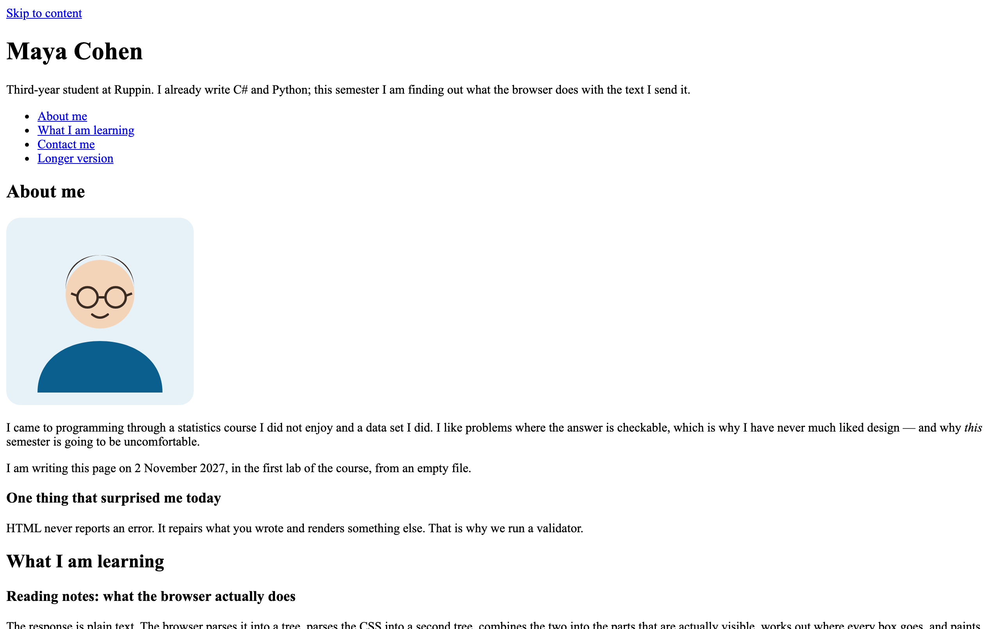
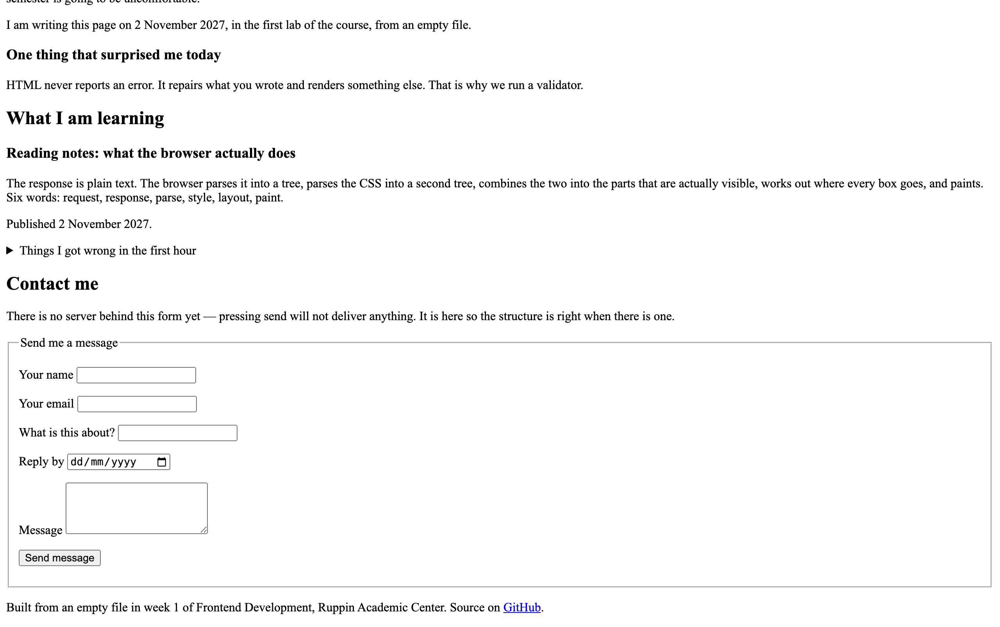

> [!goal]
> לבנות את העמוד הראשון של האתר האישי שלך — סמנטי, עם תמונה שנטענת, עם עמוד שני, שעובר ולידציה
> נקייה — ולדחוף אותו למאגר הפרטי שלך בגיטהאב עם היסטוריה שאפשר לקרוא. **וכל חלק ממנו כבר
> הקלדת היום פעם אחת, במחזור.**

זו לא מטלת תרגול שנזרקת בסוף השבוע. **העמוד הזה הוא נקודת הפתיחה של השבוע הבא** (HTML II —
הטופס, הטבלה ומעבר הנגישות נכנסים לתוכו), ומשם הוא ממשיך איתך עד סוף הסמסטר. כל מה שתבנה
כאן תסדר בשבוע ה-CSS, ולכן שווה לבנות אותו נכון עכשיו.

במחזורים של היום הקלדת שלד מקובץ ריק (מחזור 1), הפכת מרק `div` לאזורים עם רשימת ניווט
(מחזור 2), תיקנת שלושה נתיבים שבורים והוספת עמוד שני וקישור החוצה (מחזור 3), ופתחת מאגר עם
שלושה קומיטים ו-SHA (מחזור 5). המטלה היא **הרכבה** של ארבעת אלה על התוכן שלך, ואז **הרחבה**.
הקוד שכתבת במחזורים נמצא ב-`live-code/<מחזור>/end/`, פתוח לידך; הוא לא הפתרון, הוא מה
שהפתרון בנוי ממנו.

חצי מהמטלה הזו היא לא HTML. היא **התשתית**: המאגר, ההרשאה, הקומיטים והחזרה היבשה על ההגשה.
סטודנט שמגיע לשבוע 7 עם סביבה שבורה מפסיד שבוע שלם, וסטודנט שלא שלח לי הזמנה כמשתף פעולה
לא יוכל לגשת למבחן על הפרויקט שלו בשבוע 13.

## תוצרי למידה

בסיום המטלה תדע:

1. לכתוב מסמך HTML שלם מאפס — כולל `<!doctype html>`, `lang`, `charset` ו-`viewport` — ולהסביר מה כל אחד מהם עושה.
2. לבחור אלמנט לפי **מה שהוא אומר** ולא לפי איך שהוא נראה: `header`, `nav`, `main`, `section`, `article`, `aside`, `footer`, `strong`, `em`.
3. לכתוב נתיבים יחסיים שעובדים גם על מחשב אחר, ולבדוק ב-Network שהתמונה באמת נטענה.
4. לתת לתמונה `alt` שהוא החלטה, ו-`width` ו-`height` שנכנסים במסך של טלפון.
5. לקשר בין שני עמודים, ולפתוח קישור החוצה בטאב חדש בבטחה.
6. להריץ ולידטור, לקרוא את הפלט שלו, ולתקן לפי הסדר.
7. לנהל מאגר Git מהטרמינל: `clone` / `status` / `add` / `commit` / `push`, ולהוציא ממנו SHA.

## לפני שמתחילים — סביבת העבודה

אם משהו במדריך ההתקנה עדיין לא ירוק אצלך, **עצור ותסגור את זה עכשיו**, לפני שאתה כותב שורת HTML
אחת. המדריך נמצא ב-`setup/setup-he.pdf`, ונספח התקלות בסופו מכסה את השגיאות שבאמת קורות.
`pre-class/verify.mjs` אומר לך בשלוש שורות אם המכונה מוכנה.

> [!note] הכלל הכי חשוב מהשבוע הראשון
> **עמוד נפתח תמיד דרך Live Server. אף פעם לא בלחיצה כפולה על הקובץ.**
> לחיצה כפולה פותחת אותו בכתובת `file://`, וזה שובר את `fetch` (שבוע 11), מודולים של ES (שבוע 8)
> ו-`localStorage` (שבוע 11). ההרגל שנוצר בשבוע 1 מתפוצץ אחר כך.

> [!note] ואם JavaScript חלודה אצלך
> בשבוע 8 אנחנו מתחילים לכתוב JavaScript, וההרצאה **לא** תלמד משתנים, לולאות ותנאים —
> אתם כבר מתכנתים, וזה יבזבז לכם את השעה. מי שרוצה לרענן תחביר ימצא קריאה מקדימה לשבוע 8
> בתיקייה `primer/`, שתתפרסם עם חומרי שבוע 8 במאגר החומרים: רענון קצר ותשעה תרגילים עם
> פתרונות שרצים על העמוד.
> **אופציונלי, לא נבדק, לא נבחן.** אני מזכיר את זה כבר עכשיו רק כדי שתדע שהיא קיימת ותחפש
> אותה כשחומרי שבוע 8 יתפרסמו.

## איך זה אמור להיראות בסוף

זה פתרון לדוגמה של המטלה, כפי שהדפדפן מרנדר אותו. **בלי שום CSS** — כל מה שאתה רואה כאן
הוא מה שהדפדפן עושה לבד למבנה נכון. זה לא אמור להיות יפה, וזה בדיוק העניין: בשבוע ה-CSS נוסיף
עיצוב לאותו קובץ בדיוק. זו גם התמונה שראית בדקה הראשונה של השיעור (`targets/week-01.png`).

אל תעתיק את הטקסט — כתוב את שלך. **את המבנה כן תעתיק.**





> [!note]
> העמוד שלך לא צריך להיראות זהה. הוא צריך להיות **מאותו סוג**: אותם אזורים, אותם סוגי
> אלמנטים, אותה רמת שלמות. הפרטים — השם, הטקסטים, התמונה — שלך.

## המשימה, שלב אחר שלב

כל שלב מציין באיזה מחזור הקלדת אותו היום. פתח את `end/` של אותו מחזור ליד הקובץ שלך — לא כדי
להעתיק (התוכן והשמות שם שונים בכוונה), אלא כדי לזכור מה הקלדת ולמה.

1. **המאגר, ההרשאה, השכפול** {core} · *מחזור 5*
   מאגר פרטי מתבנית הקורס בשם `frontend-2027-<תעודת הזהות שלך>`; `Settings > Collaborators > Add people`
   עם שם המשתמש שנתתי בכיתה — **ברגע שאתה רואה אותי ברשימה, גם עם `Pending invite`, סיימת את
   הסעיף**; `git clone` למחשב שלך. אם עשית את זה במחזור 5 — סעיף 1 לוקח אפס דקות.

2. **תיקיית הפתיחה לתוך `week-01/`** {core} · *מחזור 5*
   העתק את **כל התוכן** של תיקיית ה-`starter` (`index.html`, `images/`, וגם התיקייה הנסתרת
   `.checks/` — בלעדיה הבדיקה שרצה בכל דחיפה לא מריצה את הבדיקות של המטלה הזאת) לתוך `week-01/` במאגר שלך.
   שם שמתחיל בנקודה מוסתר כברירת מחדל: ב-Finder של Mac מציגים אותו ב-`Cmd+Shift+.`, ובסייר של
   Windows דרך `View > Hidden items`. פתח ב-VS Code והרץ דרך Live Server. הקובץ צריך להיות
   `week-01/index.html`.

3. **השלד** {core} · *מחזור 1*
   `<!doctype html>`, `<html lang>`, `<meta charset>`, `<meta name="viewport">`, ו-`<title>` אמיתי
   שמתאר את העמוד. הכותרת שקיבלת היא `CHANGE ME` — היא לא תעבור בדיקה. סגור כל תג שפתחת,
   בסדר הפוך — ראית היום מה קורה ל-`h1` שלא נסגר.

4. **האזורים והניווט** {core} · *מחזור 2*
   `header` עם `h1` יחיד ושורה עליך · `nav` עם `ul` של קישורים לאזורי העמוד — `nav > ul > li > a`,
   כל קישור פריט ברשימה · `main` אחד ויחיד · `footer`. בתוך `main` לפחות שני `section` עם `id`
   ועם `h2`. `h1` הוא רמה בתוכן העניינים, לא גודל טקסט.

5. **תוכן אמיתי, עם תמונה שנטענת** {core} · *מחזור 3*
   שתי פסקאות עליך לפחות, ותמונה אחת עם `alt` שמתאר מה רואים בה — לא `alt="image"`, לא שם
   הקובץ. יש תמונה מוכנה ב-`images/placeholder.svg`; החלף אותה בשלך אם בא לך, **בתוך `images/`**.
   הנתיב נספר מהקובץ: `images/...`, בלי לוכסן בהתחלה, בלי `file:`, בלי `C:\`. פתח את Network
   וּודא שאין שורה אדומה — הבדיקה מסתכלת שם, לא בקוד. תן לכל `img` `width` ו-`height` שנכנסים
   ב-375, באותו יחס כמו התמונה.

6. **קישורים שאומרים לאן** {core} · *מחזור 3*
   שלושה קישורים לפחות, כולם עם טקסט שמתאר את היעד (לא "לחץ כאן"), ולפחות אחד מהם פנימי
   (`href="#about"`).

7. **הרץ ולידטור עד שהוא נקי** {core} · *מחזורים 1 ו-2*
   מהטרמינל המשולב, בתוך תיקיית העמוד:

   ```bash
   npx html-validate@9 index.html
   ```

   תקן את **השגיאה הראשונה** והרץ שוב. שלוש שגיאות מייצרות לפעמים שבע שורות פלט; אחרי תיקון
   הראשונה רובן נעלמות. הבדיקה מריצה את הוולידטור על **כל** קובץ `.html` בתיקייה — אם בנית
   גם `about.html` (שלב 10), הרץ `npx html-validate@9 index.html about.html`. בסוף — מחק כל סימון
   `CODE HERE` שנשאר בקובץ.

8. **שלושה קומיטים משמעותיים לפחות, ודחיפה** {core} · *מחזור 5*
   קומיט אחרי כל שלב, לא קומיט ענק אחד בסוף. `git status` **לפני** `git add` — ראית היום מה
   `git add .` סוחף. הודעה שאפשר להבין בלי לפתוח את השינוי:

   ```bash
   git add week-01/index.html
   git commit -m "feat: add semantic page skeleton"
   git push
   ```

9. **הגש במודל — חזרה יבשה על ההגשה** {core} · *מחזור 5*
   כתובת ה-repo, וגם ה-SHA של הקומיט האחרון:

   ```bash
   git log -1 --format=%H
   ```

10. **הרחב את העמוד** {stretch} · *מחזורים 2 ו-3*
    `article` או `aside` בשימוש נכון (הטריוויה של מועדון הקפה הייתה `aside`; רשומת קריאה שעומדת
    לבד היא `article`) · **עמוד שני** (`about.html`) המקושר בנתיב יחסי, שמקשר חזרה ל-`index.html` ·
    ודא שאין גלילה אופקית ברוחב 375 — בדרך כלל זו תמונה בלי `width` ו-`height` שנכנסים.

11. **סגור את הפינות** {challenge} · *מחזורים 2 ו-3*
    טקסט לפי משמעות: `strong` או `em` במקום שבו המשמעות באמת שם, ואף `b`, `i`, `font` או `center`
    בעמוד, ואף `br` כפול כריווח · קישור אחד לפחות החוצה, `https://`, וכל קישור שנפתח בטאב חדש
    (`target="_blank"`) נושא `rel="noopener noreferrer"`.

> [!constraints]
> - **אסור לכתוב CSS השבוע.** לא קובץ חיצוני, לא `<style>`, ולא `style=""`. העמוד אמור להיראות
>   פשוט. שבוע ה-CSS הוא זה שמסדר אותו, ועל אותו קובץ בדיוק.
> - **אסור JavaScript.** אין השבוע שום דבר שדורש אותו.
> - **אסור להעלות קבצים דרך ממשק הדפדפן של GitHub.** רק `git add` / `git commit` / `git push`
>   מהטרמינל. מהשבוע הבא מותר גם הפאנל הגרפי של VS Code.
> - **אסור נתיב מוחלט מקומי.** `file:///Users/...` או `C:\Users\...` בתוך `src` או `href` הם
>   פסילה של הסעיף — הם עובדים רק על המחשב שלך. וגם `/images/...` עם לוכסן בהתחלה: זה שורש
>   השרת, לא התיקייה שלך — ב-Live Server שלך התמונה לא תיטען. הבדיקה האוטומטית לא מורידה
>   עליו נקודות, אבל העמוד שלך שבור.
> - אסור `node_modules`, קובצי גיבוי ידניים (`index-old.html`) או קבצים זמניים במאגר.
> - **טופס, טבלה ו-`time` — לא השבוע.** הם שבוע הבא, ולא נבדקים כאן. מי שבנה טופס לא מפסיד
>   כלום, ולא מרוויח כלום.

## פירוט הניקוד

| רכיב | מה נבדק | ניקוד | סוג בדיקה |
|---|---|---|---|
| סביבת עבודה | צילום מסך (עד שניים) עם ארבעת הדברים מנספח ב של מדריך ההתקנה | 6 | ידני |
| מאגר והרשאה | מאגר פרטי בשם הנכון מהתבנית, ואני מופיע ב-`Collaborators` | 8 | ידני |
| היסטוריית Git | שלושה קומיטים משמעותיים לפחות, הודעות ברורות, בלי קבצי זבל | 6 | ידני |
| הגשה | כתובת ה-repo וה-SHA, שניהם, במודל | 4 | ידני |
| שלד המסמך | `doctype`, `lang`, `charset`, `viewport`, `title` אמיתי | 6 | אוטומטי |
| כותרת ראשית | `h1` אחד בדיוק | 4 | אוטומטי |
| מבנה סמנטי | `header`, `nav`, `main` (יחיד), `footer` | 8 | אוטומטי |
| ניווט | `nav` עם `ul` ו-`li` וקישורים, לפחות שניים | 5 | אוטומטי |
| תמונות | `alt` לכל תמונה, ולפחות אחת מתוארת באמת | 7 | אוטומטי |
| קישורים | 3 קישורים לפחות, טקסט שמתאר יעד, קישור פנימי | 6 | אוטומטי |
| נתיבים שנוסעים | אין נתיב מקומי מוחלט, וכל תמונה **נטענה** באמת | 6 | אוטומטי |
| ולידציה | כל קובצי ה-HTML בתיקייה עוברים ולידציה, ולא נשארו סימוני `CODE HERE` | 4 | אוטומטי |
| תוכן עשיר | `article` או `aside` | 5 | אוטומטי |
| עמוד שני | מקושר בנתיב יחסי, ומקשר חזרה | 9 | אוטומטי |
| רספונסיביות | אין גלילה אופקית ב-375 / 768 / 1280 | 6 | אוטומטי |
| טקסט לפי משמעות | יש `strong` או `em`; אין `b`, `i`, `font`, `center`, ואין `br` כפול | 5 | אוטומטי |
| קישור החוצה בטוח | קישור `https://` אחד לפחות; `target="_blank"` תמיד עם `rel="noopener noreferrer"` | 5 | אוטומטי |

ליבה 70 · הרחבה 20 · אתגר 10. הליבה היא הרכבה של ארבעת המחזורים ואמורה להיגמר בתוך שלושים
הדקות בכיתה; ההרחבה והאתגר — בבית, לפני המועד.

**הבדיקות האוטומטיות רצות גם אצלך.** בכל דחיפה למאגר שלך תרוץ בדיקה שמדווחת בעברית מה עבר ומה
לא. היא מריצה רק את שכבת הליבה. **ירוק זה הרצפה, לא הציון** — הוא מוכיח שהדבר רץ, והנקודות
מגיעות ממה שמכונה לא יכולה לשפוט.

> [!ai-policy]
> **שבועות 1–5 — מורה פרטי.** מותר לבקש מ-Claude הסבר, שרטוט של מבנה, או ביקורת על קוד
> שכתבת. **אסור להעתיק ממנו קוד. אתה מקליד כל תו.**
>
> במחזור 4 היום ראית למה גם הסבר צריך בדיקה: שאלה תמימה על `section` ו-`article` החזירה תשובה
> טובה, ובתוכה טענה בטוחה ושגויה על `b` ו-`i` — ו-MDN היה במרחק טאב. מה שלמדת שם הוא איך לשאול
> שאלה שאפשר לבדוק, ואיך לבדוק אותה: בוולידטור, בדפדפן, ב-MDN. לא בתחושה.
>
> **אם אינך יכול להסביר שורה — היא לא שלך.** בשבוע 13 תשב מול הפרויקט הזה בלי אינטרנט ובלי AI.
>
> אין לך מנוי? הכול עובד גם בצ'אט החינמי, ואין בכך שום חיסרון בקורס.

> [!submission]
> ההגשה במודל, ומכילה שלושה דברים:
> **כתובת ה-repo** · **ה-SHA של הקומיט** · **צילום המסך של הסביבה** (עד שניים).
>
> שני הראשונים הם מה שנבדק כל שבוע מכאן והלאה, ובאותו פורמט בדיוק. צילום המסך הוא חד-פעמי,
> לשבוע 1 בלבד — מה בדיוק צריך להיראות בו כתוב בנספח ב של מדריך ההתקנה.
>
> את ה-SHA מקבלים בפקודה `git log -1 --format=%H`, או מכפתור ההעתקה ליד הקומיט בממשק של GitHub.
>
> **ה-SHA מקפיא את ההגשה.** מה שנמצא בקומיט הזה — זה מה שנבדק. דחיפה אחרי המועד לא משנה את
> הציון, ואין על כך ויכוח. השבוע זו חזרה יבשה, כדי שבשבוע הבא אף אחד לא יגלה את זה בפעם הראשונה.
>
> **הגשה מאוחרת:** הגשה באיחור אינה מותרת ללא אישור מראש בכתב. הגשה באיחור
> תגרור הפחתה בציון.

## בדיקה עצמית

לפני שאתה מגיש, פתח את העמוד וּודא שכל אחד מאלה **קורה** — לא שכתבת אותו:

- העמוד נפתח דרך Live Server בכתובת `http://127.0.0.1:5500`, ואין שגיאות בקונסול.
- ב-Network, אחרי רענון, אין אף שורה אדומה — לא ב-`index.html` ולא ב-`about.html`.
- `npx html-validate@9 index.html` מסיים בלי שגיאות, וגם על `about.html`.
- אין בקובץ אף סימון `CODE HERE`.
- `$$('header, nav, main, footer').length` בקונסול מחזיר `4`, ו-`$$('main').length` מחזיר `1`.
- כל תמונה בעמוד מתוארת: סגור עיניים, תן למישהו להקריא רק את ה-`alt`, ותבין מה בתמונה.
- ברוחב 375 (סרגל המכשירים ב-DevTools) אין פס גלילה אופקי.
- חיפשת `<b>` ו-`<i>` בקובץ ולא מצאת; חיפשת `<br>` ולא מצאת שניים ברצף.
- העתקת את כל התיקייה למקום אחר במחשב, פתחת שוב — והתמונות והקישורים עדיין עובדים.
- `git log --oneline` מציג שלושה קומיטים לפחות, וכל הודעה מסבירה מה השתנה.
- `git status` נקי, ואין `node_modules` או `index-old.html` במאגר.
- אני מופיע ב-`Settings > Collaborators` של המאגר שלך.

> [!note]
> נתקעת? קודם `live-code/<מחזור>/end/` של המחזור שהשלב מציין — הקוד שהקלדת היום. אחר כך
> `hints-he.md` — רמז לכל שורה בניקוד, שלוש רמות. פתח את הרמה הבאה רק אחרי שניסית באמת
> חמש דקות. ואם נתקעת ב-Git, `git-panic-he.md` מכסה את חמשת המצבים שבאמת קורים, עם הפקודות
> המדויקות לצאת מהם.
>
> **דק הייחוס** (`deck-reference.pdf`) הוא עומק אופציונלי ואינו נבחן: שש המילים בעומק, איך הפרסר
> בונה את העץ, כל סוגי ה-`href`, האלמנטים הריקים, הטפסים והטבלאות של שבוע הבא, ומה Git שומר.
