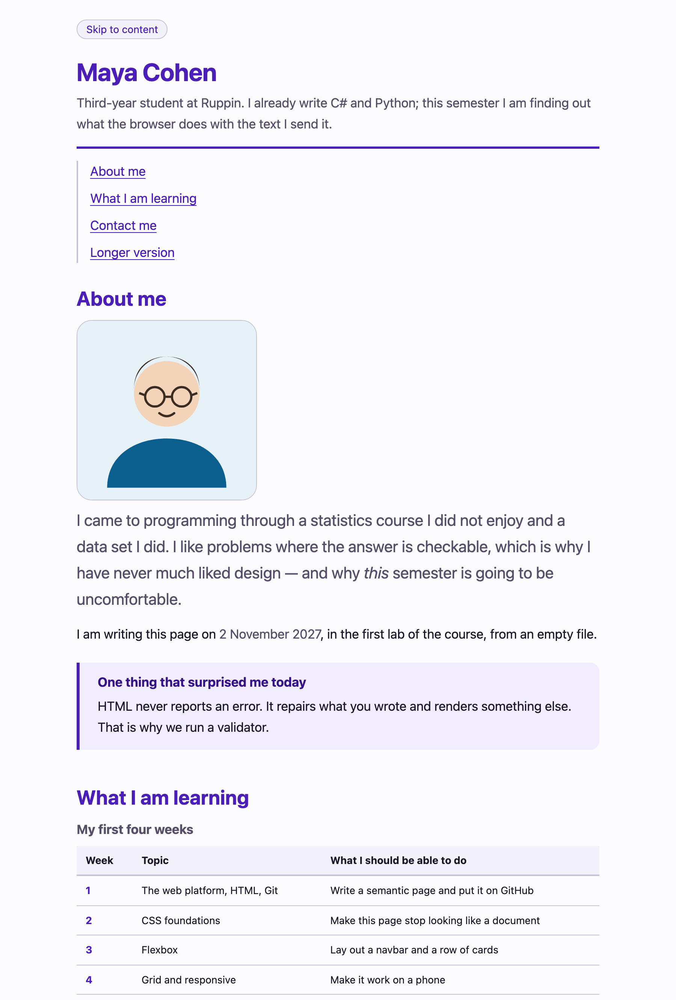
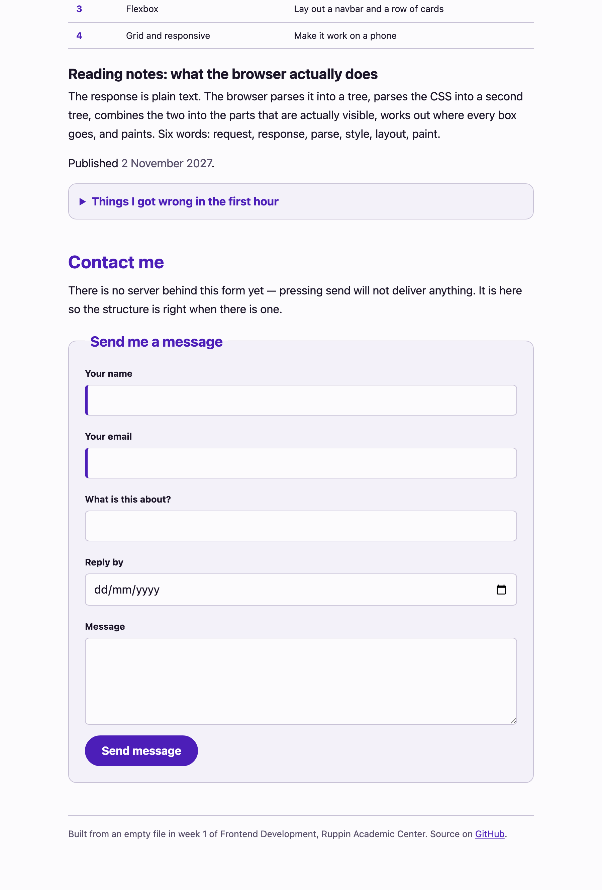

---
# Hebrew letters and spaces only in `title` — a digit or a comma inside a Hebrew run
# comes back from pdftotext wrapped in BiDi control marks and --verify cannot find it.
# The week number lives in the kicker. See COURSE_STATE.md.
title: העמוד האישי מקבל שפה עיצובית
kicker: שבוע 2 · פיתוח צד לקוח
week: 2
points: 100
deadline: לפני תחילת שיעור 3
duration: 90 דקות
weight: מטלת כיתה · 10 הטובות מתוך 12 נספרות
footer: פיתוח צד לקוח 2027 · המרכז האקדמי רופין
---

> [!goal]
> לקחת את העמוד שכתבת בשבוע שעבר — **בלי לשנות בו כמעט שום דבר** — ולהפוך אותו לעמוד
> שהיית מראה למישהו. גליון סגנונות חיצוני אחד, ערכת טוקנים מלאה, סולם טיפוגרפי,
> מערכת צבע ומצבי מעבר.

בשבוע שעבר בנית שלד. הוא נכון, הוא נגיש, והוא נראה כמו מסמך Word משנת 1996. זה לא היה
כישלון — זו הייתה נקודת ההתחלה.

השבוע מתברר מה שווה השלד הזה: **עמוד שנכתב באלמנטים הנכונים כמעט לא צריך שמות מחלקה כדי
להיות מעוצב.** `header`, `nav`, `main`, `table`, `form`, `footer` — כולם ניתנים לבחירה
לפי מה שהם. זה כל הפיצוי על העבודה של שבוע שעבר, והוא מגיע שבוע באיחור.

## תוצרי למידה

בסיום המטלה תדע:

1. לחבר גליון סגנונות חיצוני, ולהסביר למה זו הדרך היחידה מבין השלוש.
2. לחשב ספציפיות של בורר כשלשה, ולהכריע איזה כלל ינצח — בלי לנחש ובלי `!important`.
3. להשתמש ב-`box-sizing: border-box` ולהסביר מה בדיוק הוא שינה.
4. לבנות ערכת טוקנים — `--color-*`, `--space-*`, `--radius-*`, `--font-*` — ולעצב ממנה.
5. לבחור יחידה לפי המשימה: `rem` לטיפוגרפיה ולמרווחים, `ch` למידת שורה, `px` למסגרות.
6. לבנות מערכת צבע ב-`hsl` ולוודא שהיא עוברת יחס ניגודיות של 4.5 לאחד.

## מה בדיוק אתה מעצב

**את העמוד שלך משבוע שעבר.** העתק את `week-01/index.html` ואת `about.html` לתוך
`week-02/`, הוסף להם שורת `link` אחת, וכתוב `styles.css`.

> [!note] אם העמוד של שבוע שעבר לא מוכן
> בתיקיית הפתיחה נמצא **עמוד חלופי** — עמוד תקין ומלא, מוכן לעיצוב. השתמש בו וציין
> את זה בהגשה. **אינך מפסיד על כך נקודות.** הניקוד השבוע הוא על גליון הסגנונות,
> לא על ה-HTML. אל תבזבז חצי מהשיעור על שחזור של שבוע שעבר.

## איך זה אמור להיראות בסוף

זהו פתרון לדוגמה — **אותו HTML בדיוק** של שבוע שעבר, ועוד קובץ CSS אחד. אין בו שורת
JavaScript, אין בו Flexbox, אין בו Grid, ואין בו מיקום.





> [!note]
> **אל תנסה להעתיק את הצבע שלי.** בחר גוון משלך. מה שנבדק הוא שהמערכת קוהרנטית ושהיא
> עוברת ניגודיות — לא שהיא סגולה.

## המשימה, שלב אחר שלב

1. **הקם את התיקייה וחבר את הגליון** {core}
   `week-02/` במאגר שלך: `index.html`, `about.html`, `styles.css` ותיקיית `images`.
   בראש כל אחד משני העמודים, שורה אחת:

   ```html
   <link rel="stylesheet" href="styles.css" />
   ```

   מכאן **אינך נוגע ב-HTML יותר** — חוץ ממחלקה אחת שתצטרך בסעיף 4.

2. **שלוש השורות הראשונות בגליון** {core}
   האיפוס. `width` צריך להיות רוחב התיבה, כולל הריפוד והמסגרת, לכל אלמנט בעמוד —
   כולל שני האלמנטים המדומים, כי גם הם תיבות.

3. **ערכת הטוקנים** {core}
   בבלוק `:root`, וזה הבלוק שאתה בונה לפני שאתה כותב כלל אחד:

   | משפחה | כמה לפחות | מה חייב להיות בפנים |
   |---|---|---|
   | `--color-*` | 5 | רקע לעמוד, משטח מורם, מסגרת, טקסט, צבע מותג |
   | `--space-*` | 5 | סולם ב-`rem`, כל שלב קפיצה ברורה מקודמו |
   | `--radius-*` | 2 | אחד לדברים קטנים, אחד לגדולים |
   | `--font-*` | 3 | משפחת גופנים, וסולם גדלים |

   שני כללים על השמות: **קרא להם על שם התפקיד ולא על שם המראה** — `--color-accent`,
   לא `--color-purple`. וכתוב את הצבעים ב-`hsl`, כי אז כל הפלטה היא אותו גוון בבהירויות
   שונות, ואפשר לראות את הקשר ביניהם.

4. **הקרקע, הטיפוגרפיה והמידה** {core}
   על `body`: משפחת גופנים, גודל בסיס, גובה שורה של 1.5 עד 1.7, צבע טקסט, רקע.
   ו-`max-width` שמגביל את אורך השורה — שורה שרצה על פני מסך של 27 אינץ' קשה לקריאה,
   כי העין מאבדת את המקום בדרך חזרה שמאלה. `ch` היא היחידה שאומרת בדיוק את זה.

   הכותרות: `h1` גדולה מ-`h2`, שגדולה מ-`h3`. **גובה השורה של כותרת צפוף יותר משל
   פסקה** — בגודל 2rem, גובה שורה של פסקה פותח תהום בין שתי השורות של כותרת אחת.

   כאן גם המחלקה היחידה שאתה מוסיף: `class="lede"` על פסקת הפתיחה של המקטע הראשון,
   מעט גדולה יותר. אין אלמנט שמשמעותו "פסקת הפתיחה", וזה בדיוק המצב שבו מחלקה היא
   התשובה הנכונה.

5. **המרווחים — מהסולם, לא מהאצבע** {core}
   כל `margin` וכל `padding` בקובץ באים מ-`var(--space-N)`. ברגע שיש סולם אתה כבר לא
   בוחר בין 13 ל-15 פיקסלים; אתה בוחר שלב.

6. **מצבי הקישורים והכפתור** {core}
   `a` בצבע משלו · `a:hover` שמשנה משהו שרואים · `a:focus-visible` עם `outline` ברור.

   `outline: none` בלי חלופה הוא פסילה של הסעיף. בשבוע 13 תשב מול מחשב לא מוכר ותנווט
   במקלדת; טבעת פוקוס היא לא קישוט.

7. **הרכיבים** {stretch}
   ארבעה מקומות שבהם עמוד נראה גמור או נראה טיוטה:
   הטבלה (`border-collapse`, ריפוד לתאים, שורת כותרת שנראית כמו כותרת) ·
   הטופס (`fieldset`, `legend`, שדות שנוח להקליד בהם, כפתור שנראה כמו כפתור) ·
   ה-`aside` כמשטח מורם · בלוק ה-`details`.

   **`font: inherit` על השדות הוא לא רשות.** דפדפנים נותנים לפקדי טופס גופן משלהם,
   שלא יורש כלום, וטופס שלא נגעת בו נראה כאילו הודבק מאתר אחר.

8. **העמוד השני, בחינם** {stretch}
   פתח את `about.html`. הוא כבר מעוצב, כי הוא מצביע על אותו קובץ. זו כל ההנמקה של
   גליון חיצוני, והיא ההנמקה של מטלת הבית שמתפרסמת השבוע.

9. **בדוק ניגודיות** {stretch}
   כל צמד טקסט-רקע בעמוד: **4.5 לאחד לפחות**. בודק הניגודיות של WebAIM לוקח שני
   ערכי צבע ומחזיר את היחס. אם צבע נכשל — הורד את הבהירות שלו ב-`hsl` ובדוק שוב.
   זו עבודה של שתי דקות, וזו ההפרדה בין עמוד יפה לעמוד קריא.

10. **טווח בוררים** {stretch}
    השתמש לפחות פעם אחת ב-`::before` או ב-`::after`, או בבורר תכונה כמו
    `input[type="email"]`. יש בעמוד מקום שבו אחד מהם הוא באמת התשובה הנכונה.

11. **ערכת נושא כהה** {challenge}
    בלוק אחד:

    ```css
    @media (prefers-color-scheme: dark) {
      :root { /* אותם שמות טוקנים, ערכים אחרים */ }
    }
    ```

    **ואף שינוי אחד מתחת לבלוק הטוקנים.** אם זה עולה לך יותר מזה, הטוקנים עוד לא
    עושים את העבודה שלהם — וכדאי לדעת את זה עכשיו ולא בשבוע 5.
    הערכה הכהה חייבת לעבור ניגודיות בעצמה. צבע שנקרא מצוין על לבן כמעט נעלם על שחור.

12. **תנועה, בזהירות** {challenge}
    מעבר קצר על `a:hover` או על הכפתור — עד 200 מילישניות — שמכבד את
    `prefers-reduced-motion`. יש מי שמרגיש בחילה מממשקים שזזים, והוא סימן את זה
    במערכת ההפעלה שלו.

    **אפשר לעשות את זה בלי `!important`:** שים את משך המעבר בטוקן, ושנה את הטוקן
    בתוך שאילתת המדיה. אותה תוצאה בדיוק, בלי מלחמת דריסות.

> [!constraints]
> - **אסור Flexbox ואסור Grid.** שניהם בשבועות 3 ו-4. כל מה שיש כאן הוא זרימה רגילה,
>   וזו השכבה שעליה שני השבועות הבאים יושבים. אם אתה נאבק בפריסה — עצור, היא לא
>   אמורה להיות קשה השבוע.
> - **אסור `position: absolute` או `fixed` או `sticky`.** שבוע 3.
> - `display` הוא הנושא של שבוע 3, **ולא אמור להיות לך צורך בו.** הפתרון לדוגמה לא
>   משתמש בו אף פעם. אם בכל זאת תכתוב `display: block` על תווית — לא תפסיד על כך
>   נקודה. `display: flex` או `display: grid` פוסלים את הסעיף.
> - **אסור `!important`.** הוא לא תיקון, הוא הימור על כך שאף אחד לעולם לא יצטרך
>   לדרוס אותך. אתה תצטרך.
> - **אסור `style=""` בתוך ה-HTML**, ואסור תגית `<style>`. הכול בקובץ החיצוני.
> - **אסור פריימוורק, אסור CDN, ואסור גליון מועתק.** כל שורה בקובץ נכתבה על ידך.
> - **אל תשנה את ה-HTML** מלבד שורת ה-`link` והמחלקה `lede`.

## פירוט הניקוד

| רכיב | מה נבדק | ניקוד | סוג בדיקה |
|---|---|---|---|
| גליון חיצוני | `link` תקין, והגליון באמת נטען עם כללים בפנים | 4 | אוטומטי |
| האיפוס | `box-sizing: border-box` חל על כל האלמנטים | 5 | אוטומטי |
| ערכת טוקנים | 5 צבע · 5 מרווח · 2 רדיוס · 3 גופן, על `:root` | 12 | אוטומטי |
| קרקע העמוד | גופן, צבע, רקע, גובה שורה ומידה — ובלי גלילה אופקית | 6 | אוטומטי |
| סולם טיפוגרפי | סדר גדלים נכון, וגובה שורה צפוף לכותרות | 6 | אוטומטי |
| מרווחים מהסולם | ערכי `margin` ו-`padding` מגיעים מטוקנים | 6 | אוטומטי |
| מצבי קישור | צבע, `hover` שמשנה משהו, `focus-visible` שרואים | 6 | אוטומטי |
| שמירת המגבלות | בלי flex, grid, `display`, מיקום, `!important` וסימוני `CODE HERE` | 7 | אוטומטי |
| איכות העיצוב | היררכיה, קצב, איפוק — האם זה עמוד שהיית מראה למישהו | 10 | ידני |
| איכות הקוד | סדר בגליון, שמות שאומרים כוונה, בלי חזרות | 5 | ידני |
| היסטוריית Git | קומיטים משמעותיים עם הודעות ברורות | 3 | ידני |
| רכיבים מעוצבים | הטבלה והטופס — ריפוד, מסגרות, שורת כותרת, `font: inherit` | 6 | אוטומטי |
| עמוד שני | `about.html` מקבל את אותו עיצוב מאותו קובץ | 6 | אוטומטי |
| ניגודיות | כל טקסט בעמוד עובר 4.5 לאחד | 5 | אוטומטי |
| טווח בוררים | אלמנט מדומה או בורר תכונה, בשימוש אמיתי | 3 | אוטומטי |
| ערכה כהה | `prefers-color-scheme` דרך טוקנים בלבד, ועוברת ניגודיות | 6 | אוטומטי |
| תנועה בטוחה | מעבר קצר שמכבד `prefers-reduced-motion` | 2 | אוטומטי |
| אפס צבעים קשיחים | אין ערך צבע מילולי מתחת לבלוק הטוקנים | 2 | אוטומטי |

ליבה 70 · הרחבה 20 · אתגר 10. הליבה אמורה להיגמר בתוך 90 הדקות. אם סיימת אותה ונשאר
לך זמן, עבור להרחבה — לא לקישוטים.

**הבדיקות האוטומטיות רצות גם אצלך.** בכל דחיפה למאגר תרוץ בדיקה שמדווחת בעברית מה עבר
ומה לא, והיא מריצה רק את שכבת הליבה. **ירוק זה הרצפה, לא הציון** — עשר הנקודות של איכות
העיצוב הן בדיוק מה שמכונה לא יכולה לשפוט.

> [!ai-policy]
> **שבועות 1–4 — מורה פרטי.** מותר לבקש מ-Claude הסבר על המפל, על ספציפיות או על
> יחידות, ומותר לבקש ביקורת על CSS שכתבת. **אסור להעתיק ממנו קוד. אתה מקליד כל תו.**
>
> השבוע יש לזה סיבה נוספת וספציפית: כלֵי AI כותבים CSS ב-Flexbox וב-Grid כברירת מחדל,
> כי זה מה שרוב הקוד בעולם עושה. תקבל פתרון שעובד, שאתה לא מבין, ושפוסל את הסעיף.
>
> **אם אינך יכול להסביר שורה — היא לא שלך.** בשבוע 13 תשב מול הפרויקט הזה בלי אינטרנט
> ובלי AI.
>
> אין לך מנוי? הכול עובד גם בצ'אט החינמי, ואין בכך שום חיסרון בקורס.

> [!submission]
> ההגשה במודל, ומכילה שני דברים: **כתובת ה-repo** ו-**ה-SHA של הקומיט**.
>
> ```bash
> git log -1 --format=%H
> ```
>
> **ה-SHA מקפיא את ההגשה.** מה שנמצא בקומיט הזה הוא מה שנבדק. דחיפה אחרי המועד לא
> משנה את הציון. בשבוע שעבר זו הייתה חזרה יבשה; מהשבוע זה ההליך.
>
> אם השתמשת בעמוד החלופי במקום בעמוד שלך — כתוב שורה אחת על כך בטקסט ההגשה.
>
> **הגשה מאוחרת:** ההגשה נסגרת במועד שכתוב במודל. הגשה שמגיעה אחרי המועד מתקבלת
> ונבדקת במלואה, ומסומנת כמאוחרת — היא אינה מורידה נקודות.

## בדיקה עצמית

- העמוד נפתח דרך Live Server, ואין שגיאות בקונסול.
- מחקת את `styles.css` לרגע והעמוד קרס לטקסט שחור על לבן — כלומר הכול באמת בגליון.
- אין בגליון אף סימון `CODE HERE`.
- שינית ערך אחד ב-`:root` וראית את השינוי במקומות רבים בעמוד בבת אחת.
- חיפשת בקובץ את המחרוזת `#` ואת `rgb` — ומצאת אותן רק בתוך בלוק הטוקנים.
- לחצת Tab מתחילת העמוד ובכל עצירה ראית בבירור איפה אתה נמצא.
- העברת עכבר על קישור וראית שינוי.
- `about.html` נראה כמו `index.html`, ולא נגעת בו בכלל אחרי שורת ה-`link`.
- בדקת שני צמדי צבע לפחות בבודק ניגודיות, ושניהם מעל 4.5.
- העמוד נראה תקין ברוחב 375, 768 ו-1280, ואין גלילה אופקית.
- `git log --oneline` מציג קומיטים שאפשר להבין בלי לפתוח את השינוי.

> [!note]
> אין מתרגל בקורס. למטלה מצורף `hints-he.md` עם שלוש רמות רמזים — רמז, אסטרטגיה,
> וכמעט-פתרון. פתח את הרמה הבאה רק אחרי שניסית באמת.
