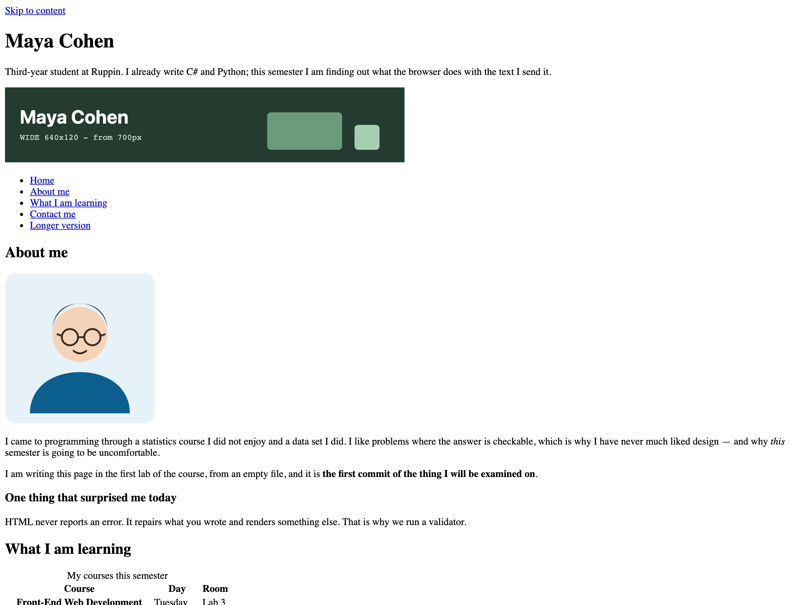
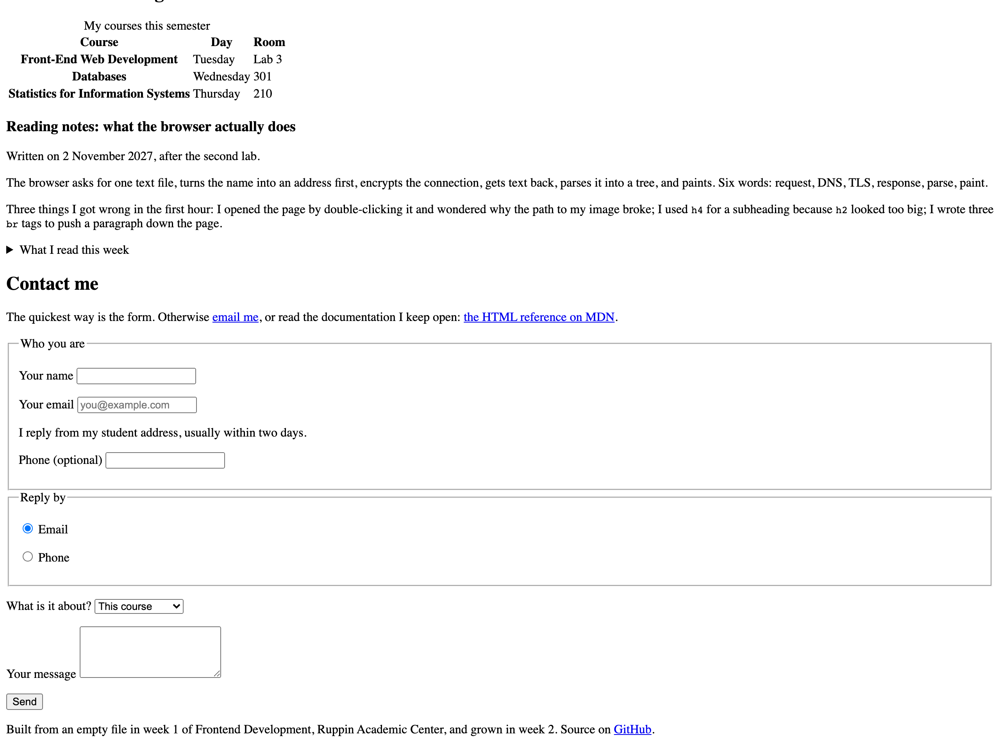

> [!goal]
> להצמיח את העמוד שבנית בשבוע שעבר: טופס יצירת קשר שכל מילה בו לחיצה, טבלה שקורא מסך יודע
> לנווט בה, תאריך שמכונה קוראת, קישור דילוג, ניווט שאומר איפה אתה — ולהריץ עליו את דוח
> הנגישות הראשון. **וכל חלק ממנו כבר הקלדת היום פעם אחת, במחזור — על עמוד אחר.**

זה אותו קובץ. `week-01/index.html` ו-`about.html` שדחפת בשבוע שעבר הם נקודת הפתיחה, והשבוע
הם עוברים ל-`week-02/` ומקבלים את מה שהבטחנו שם: הטופס, הטבלה, ומעבר הנגישות. בשבוע הבא
אותו קובץ בדיוק מקבל גיליון סגנון — ולכן שווה שהמבנה יהיה נכון עכשיו.

במחזורים של היום הקלדת טופס שנכשל יפה והפכת אותו לטופס עם `label for`, `name`, `type`,
`required`, `fieldset` ורמז (מחזור 1), הפכת פסקה לטבלה עם `caption` ו-`th scope` ונתת לתאריכים
`time datetime` (מחזור 2), הוספת קישור דילוג ו-`aria-current` והרצת Lighthouse בפעם הראשונה
(מחזור 3), ראית טופס שירוק בכלי ונכשל בלחיצה (מחזור 4), ובנית `details` ו-`picture` בלי שורת
JavaScript (מחזור 5). המטלה היא **הרכבה** של חמשת אלה על העמוד שלך, ואז **הרחבה**. הקוד
שכתבת במחזורים נמצא ב-`live-code/<מחזור>/end/`, פתוח לידך; הוא על מועדון הקולנוע ולא על
האתר שלך, בכוונה — הוא לא הפתרון, הוא מה שהפתרון בנוי ממנו.

## תוצרי למידה

בסיום המטלה תדע:

1. לבנות טופס שבו לכל שדה `label` עם `for` שמצביע על ה-`id` שלו, `name` שנשלח, ו-`type` שמביא ולידציה ומקלדת — ולהסביר למה `placeholder` הוא לא תווית.
2. לקבץ שדות ב-`fieldset` עם `legend`, ולחבר רמז לשדה ב-`aria-describedby`.
3. לבנות טבלה שמתארת את עצמה: `caption`, `thead` עם `th scope="col"`, `tbody` עם `th scope="row"`.
4. לכתוב תאריך פעמיים — לאנשים בטקסט, למכונה ב-`datetime`.
5. לתת לקורא שלא רואה את הדרך הביתה: קישור דילוג, `main` שמקבל פוקוס, `aria-current="page"`, כותרות בסדר, ו-Tab שהולך לפי המסמך.
6. להריץ דוח נגישות (Lighthouse ב-DevTools), לקרוא כל שורה אדומה, ולדעת מה הדוח **לא** בודק.
7. לבנות `details`/`summary` ו-`picture` — התנהגות בלי JavaScript.

## איך זה אמור להיראות בסוף

זה פתרון לדוגמה של המטלה, כפי שהדפדפן מרנדר אותו. **בלי שום CSS** — המסגרת סביב השדות,
המשולש ליד "What I read this week" והכותרות המודגשות בטבלה הם מה שהדפדפן עושה לבד למבנה
נכון. זו גם התמונה שראית בדקה הראשונה של השיעור (`targets/week-02.png`).

אל תעתיק את הטקסט — כתוב את שלך. **את המבנה כן תעתיק.**





> [!note]
> העמוד שלך לא צריך להיראות זהה. הוא צריך להיות **מאותו סוג**: אותם אזורים, אותם סוגי
> אלמנטים, אותה רמת שלמות. הפרטים — הטקסטים, הטבלה, שדות הטופס — שלך.

## המשימה, שלב אחר שלב

כל שלב מציין באיזה מחזור הקלדת אותו היום. פתח את `end/` של אותו מחזור ליד הקובץ שלך — לא כדי
להעתיק (התוכן והשמות שם שונים בכוונה), אלא כדי לזכור מה הקלדת ולמה.

1. **העמוד שלך, לתוך `week-02/`** {core} · *לפני השיעור*
   העתק את `week-01/index.html`, `week-01/about.html` ו-`week-01/images/` לתוך `week-02/` במאגר
   שלך. אם שבוע 1 לא הלך טוב — תיקיית ה-`starter` היא עמוד גמור לדוגמה; העתק את התוכן שלה
   במקום, והפוך את הטקסט לשלך. פתח ב-Live Server. `pre-class/verify.mjs` בודק ששני הקבצים
   במקום ודחופים.

2. **הטופס, כמו שצריך** {core} · *מחזור 1*
   ב-`section#contact`: `form` עם `fieldset` ו-`legend`, ולפחות ארבעה שדות. לכל שדה `label` שה-`for`
   שלו מצביע על ה-`id` של השדה — **לחץ על המילים: הסמן חייב לזוז לשדה** — ו-`name`, כי בלי `name`
   השדה לא נשלח (לחץ Send וקרא את שורת הכתובת). שני סוגי קלט לפחות שאינם `text`, ואחד מהם
   `type="email"`. שדה אחד לפחות `required`, וכפתור `type="submit"`.

3. **טבלה שמתארת את עצמה** {core} · *מחזור 2*
   ב-`section#learning`: נתונים טבלאיים אמיתיים שלך — הקורסים, השבוע, רשימת קריאה. `caption`,
   `thead` שכל התאים בו `th scope="col"`, `tbody` עם שתי שורות לפחות. `td` מודגש הוא תא, לא
   כותרת: פתח את לשונית Accessibility ותראה `cell` במקום `columnheader`.

4. **תאריך שמכונה קוראת** {core} · *מחזור 2*
   משפט עם התאריך שבו כתבת את הרשומה: `<time datetime="2027-11-02">2 November 2027</time>`.
   ה-`datetime` הוא שנה-חודש-יום. הטקסט — איך שתרצה.

5. **הקורא שלא רואה** {core} · *מחזור 3*
   `<a href="#main">Skip to content</a>` כאלמנט הראשון ב-`body`, ו-`main` עם `id="main"` ו-`tabindex="-1"`.
   בניווט: קישור לעמוד עצמו (`index.html`) עם `aria-current="page"` — **בדיוק אחד בכל עמוד**.
   כותרות בסדר: `h1` אחד, ואחרי `h2` באה `h3`. בלי `tabindex` חיובי בשום מקום.

6. **הדוח הראשון, והוולידטור** {core} · *מחזור 3*
   DevTools, לשונית Lighthouse, Accessibility בלבד. קרא כל שורה אדומה. `target-size` (ריווח
   בין קישורי הניווט) תישאר — היא מתוקנת ב-CSS, בשבוע הבא, והבודק לא סופר אותה. כל שורה
   אחרת — תקן. ואז, מהטרמינל המשולב, בתוך `week-02/`:

   ```bash
   npx html-validate@9 index.html about.html
   ```

   אפס שגיאות בשני הקבצים, ואף סימון `CODE HERE` שנשאר.

7. **שלושה קומיטים משמעותיים לפחות, ודחיפה** {core} · *שבוע 1*
   קומיט אחרי כל שלב. `git status` לפני `git add`. הודעה שאפשר להבין בלי לפתוח את השינוי:

   ```bash
   git add week-02
   git commit -m "feat: contact form with labelled fields"
   git push
   ```

8. **הגש במודל** {core}
   כתובת ה-repo, וגם ה-SHA של הקומיט האחרון: `git log -1 --format=%H`.

9. **הרחב את העמוד** {stretch} · *מחזורים 1, 2, 3 ו-5*
   רמז מתחת לשדה, מחובר ב-`aria-describedby` · `details` עם `summary` שנפתח בלי JavaScript ·
   `picture` עם `source srcset media` ו-`img` **אחרון** עם `alt`, `width` ו-`height` (שני באנרים מוכנים
   ב-`images/`) · `th scope="row"` על התא הראשון בכל שורה של הטבלה · ו-`about.html` מקבל את
   אותן שלוש שורות: קישור דילוג, `main` שמקבל פוקוס, ו-`aria-current="page"` על הקישור ל-`about.html`.

10. **סגור את הפינות** {challenge} · *מחזורים 1, 4 ו-5*
    ה-`picture` נכנס בכל רוחב — סרגל המכשירים ב-375, 768 ו-1280, בלי גלילה אופקית · קבוצת
    `radio` (שניים לפחות עם אותו `name`, ב-`fieldset` עם `legend`, כל אחד עם `label`) · ואף שדה עם
    `aria-label`, ואף שדה שה-`placeholder` הוא כל מה שיש לו — השם של כל שדה הוא המילים שרואים.

> [!constraints]
> - **אסור לכתוב CSS השבוע.** לא קובץ חיצוני, לא `<style>`, ולא `style=""`. העמוד אמור להיראות
>   פשוט. שבוע ה-CSS הוא זה שמסדר אותו, ועל אותו קובץ בדיוק.
> - **אסור JavaScript.** `details` ו-`picture` הם בדיוק ההוכחה שלא צריך.
> - **אסור `aria-label` על שדות טופס.** תווית היא מילים על המסך. `aria-label` עובר את הכלי
>   ונכשל בלחיצה — ראית את זה במחזור 4.
> - **אסור `tabindex` חיובי.** אם הסדר לא נכון — מזיזים את האלמנט בקובץ.
> - **אסור להעלות קבצים דרך ממשק הדפדפן של GitHub.** `git add` / `git commit` / `git push`,
>   מהטרמינל או מהפאנל של VS Code.
> - אסור `node_modules`, קובצי גיבוי ידניים או קבצים זמניים במאגר.

## פירוט הניקוד

| רכיב | מה נבדק | ניקוד | סוג בדיקה |
|---|---|---|---|
| היסטוריית Git | שלושה קומיטים משמעותיים לפחות, הודעות ברורות, בלי קבצי זבל | 6 | ידני |
| הגשה | כתובת ה-repo וה-SHA, שניהם, במודל | 4 | ידני |
| טופס נגיש | `fieldset`+`legend`, 4+ שדות עם `label` מקושר, `required`, כפתור שליחה | 9 | אוטומטי |
| שמות לשדות | לכל שדה יש `name` | 5 | אוטומטי |
| סוגי קלט | שני סוגים לפחות מעבר ל-`text`, ואחד מהם `email` | 4 | אוטומטי |
| טבלה | `caption`, `thead` של `th scope="col"`, `tbody` עם 2+ שורות | 8 | אוטומטי |
| תאריך למכונה | `time` עם `datetime` בפורמט תקין | 4 | אוטומטי |
| סדר כותרות | `h1` אחד, אין דילוג על רמה | 6 | אוטומטי |
| קישור דילוג | ראשון בעמוד, אל `main` עם `id` ו-`tabindex="-1"` | 5 | אוטומטי |
| העמוד הנוכחי | בדיוק קישור אחד עם `aria-current="page"`, לעמוד הזה | 5 | אוטומטי |
| נגישות | axe, תקן WCAG AA, על העמוד עם הטופס | 6 | אוטומטי |
| סדר Tab | שדות הטופס בסדר המסמך, בלי `tabindex` חיובי | 4 | אוטומטי |
| ולידציה | שני העמודים עוברים `html-validate`, ואין `CODE HERE` | 4 | אוטומטי |
| רמז לשדה | `aria-describedby` שמצביע על טקסט קיים | 5 | אוטומטי |
| תמונה שבוחרת מקור | `picture` עם `source srcset media`, ו-`img` אחרון עם `alt`, `width`, `height` | 5 | אוטומטי |
| נפתח בלי JavaScript | `details` עם `summary` | 4 | אוטומטי |
| כותרות שורה | `th scope="row"` בכל שורה | 3 | אוטומטי |
| העמוד השני | `about.html` עם קישור דילוג ו-`aria-current` על עצמו | 3 | אוטומטי |
| התמונה נכנסת | אין גלילה אופקית ב-375 / 768 / 1280 | 4 | אוטומטי |
| קבוצת radio | 2+ עם אותו `name`, ב-`fieldset` עם `legend`, כל אחד עם `label` | 3 | אוטומטי |
| תוויות גלויות | אף `aria-label` על שדה, אף שדה שהוא `placeholder` בלבד | 3 | אוטומטי |

ליבה 70 · הרחבה 20 · אתגר 10. הליבה היא הרכבה של המחזורים ואמורה להיגמר בתוך שלושים
הדקות בכיתה; ההרחבה והאתגר — בבית, לפני המועד.

**הבדיקות האוטומטיות רצות גם אצלך.** בכל דחיפה למאגר שלך תרוץ בדיקה שמדווחת בעברית מה עבר ומה
לא. היא מריצה רק את שכבת הליבה. **ירוק זה הרצפה, לא הציון** — השבוע ראית את זה פעמיים: טופס
שעבר ולידציה ושלח כלום, וטופס שקיבל 100 ב-Lighthouse ולא הגיב ללחיצה.

> [!ai-policy]
> **שבועות 1–5 — מורה פרטי.** מותר לבקש מ-Claude הסבר, שרטוט של מבנה, או ביקורת על קוד
> שכתבת. **אסור להעתיק ממנו קוד. אתה מקליד כל תו.**
>
> במחזור 4 היום ביקשת ביקורת נגישות על טופס, ושאלת אם `aria-label` מספיק. התשובה אמרה כן,
> וצדקה לגבי הכלי: axe ו-Lighthouse עברו. ואז לחצת על המילים ולא קרה כלום. מה שלמדת שם הוא
> שכלי בודק מה שהוא בודק, ושאת התקן אתה מנסח כאילוץ שאפשר לבדוק — לא כשאלה שאפשר להסכים לה.
>
> **אם אינך יכול להסביר שורה — היא לא שלך.** בשבוע 13 תשב מול הפרויקט הזה בלי אינטרנט ובלי AI.
>
> אין לך מנוי? הכול עובד גם בצ'אט החינמי, ואין בכך שום חיסרון בקורס.

> [!submission]
> ההגשה במודל, ומכילה שני דברים:
> **כתובת ה-repo** · **ה-SHA של הקומיט**.
>
> באותו פורמט בדיוק כמו בשבוע שעבר, וכמו בכל שבוע מכאן והלאה. את ה-SHA מקבלים בפקודה
> `git log -1 --format=%H`, או מכפתור ההעתקה ליד הקומיט בממשק של GitHub.
>
> **ה-SHA מקפיא את ההגשה.** מה שנמצא בקומיט הזה — זה מה שנבדק. דחיפה אחרי המועד לא משנה את
> הציון, ואין על כך ויכוח.
>
> **הגשה מאוחרת:** ההגשה נסגרת במועד שכתוב במודל. הגשה שמגיעה אחרי המועד מתקבלת
> ונבדקת במלואה, ומסומנת כמאוחרת — היא אינה מורידה נקודות.

## בדיקה עצמית

לפני שאתה מגיש, פתח את העמוד וּודא שכל אחד מאלה **קורה** — לא שכתבת אותו:

- לחיצה על **כל** מילה שמעל שדה מזיזה את הסמן לתוך השדה שלה.
- Send על טופס ריק נעצר על שדה `required` עם הודעה של הדפדפן; Send מלא כותב בשורת הכתובת
  מפתח אחד לכל שדה.
- בלשונית Accessibility, כותרות הטבלה הן `columnheader` ו-`rowheader`, לא `cell`.
- לחיצה בשורת הכתובת ואז Tab מסמנת את Skip to content; Enter, ואז `document.activeElement` בקונסול
  מחזיר `main`.
- `$$('nav a[aria-current="page"]').length` מחזיר `1` — בשני העמודים — וה-`href` שלו הוא העמוד
  שאתה בו.
- Lighthouse Accessibility: כל שורה אדומה שנשארה היא כזאת שאתה יודע להגיד מה היא ולמה.
- `npx html-validate@9 index.html about.html` מסיים בלי שגיאות, ואין בקבצים אף `CODE HERE`.
- ברוחב 375 (סרגל המכשירים) הבאנר הצר מופיע, ואין פס גלילה אופקי.
- חיפשת `aria-label` בקובץ ולא מצאת; חיפשת `tabindex="1"` ולא מצאת.
- `git log --oneline` מציג שלושה קומיטים לפחות מהשבוע, ו-`git status` נקי.

> [!note]
> נתקעת? קודם `live-code/<מחזור>/end/` של המחזור שהשלב מציין — הקוד שהקלדת היום. אחר כך
> `hints-he.md` — רמז לכל שורה בניקוד, שלוש רמות. פתח את הרמה הבאה רק אחרי שניסית באמת
> חמש דקות.
>
> **דק הייחוס** (`deck-reference.pdf`) הוא עומק אופציונלי ואינו נבחן: כל סוגי ה-`input`, `get` מול
> `post`, כל פורמט של `datetime`, עץ הנגישות ואיך שם של אלמנט מחושב, חמשת הכללים של ARIA,
> שורות ה-WCAG של השבוע, וכללי axe שראית בדוח.
