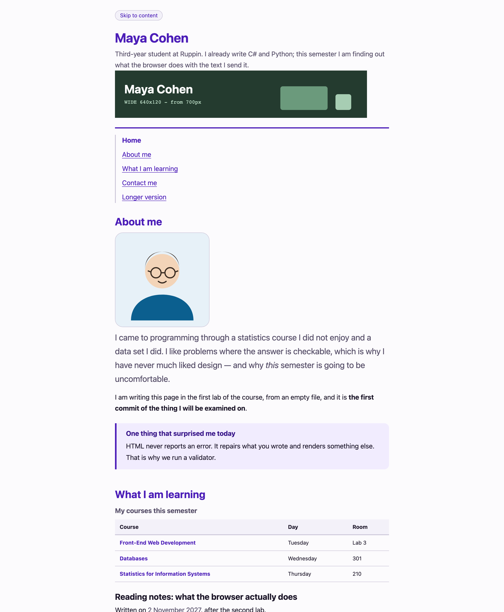
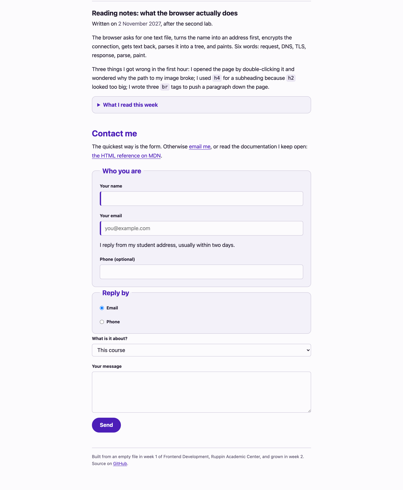

---
# Hebrew letters and spaces only in `title` — a digit or a comma inside a Hebrew run
# comes back from pdftotext wrapped in BiDi control marks and --verify cannot find it.
# The week number lives in the kicker. See COURSE_STATE.md.
title: העמוד האישי מקבל שפה עיצובית
kicker: שבוע 3 · מטלת כיתה 3 · פיתוח צד לקוח
week: 3
points: 100
deadline: לפני תחילת שיעור 4
duration: 30 דקות בכיתה (145–175), והשלמה בבית
weight: מטלת כיתה · 10 הטובות מתוך 12 נספרות
footer: פיתוח צד לקוח 2027 · המרכז האקדמי רופין
---

> [!goal]
> לקחת את העמוד שבנית בשבועיים האחרונים — **בלי לשנות בו כמעט שום דבר** — ולהפוך אותו לעמוד
> שהיית מראה למישהו. גיליון סגנונות חיצוני אחד, ערכת טוקנים, סולם טיפוגרפי, מערכת צבע שעוברת
> ניגודיות ומצבי מעבר. **וכל חלק ממנו כבר הקלדת היום פעם אחת, במחזור — על עמוד אחר.**

זה אותו קובץ. `week-02/index.html` ו-`about.html` שדחפת בשבוע שעבר הם נקודת הפתיחה, והשבוע הם
עוברים ל-`week-03/` ומקבלים שורת `link` אחת ו-`styles.css`. **עמוד שנכתב באלמנטים הנכונים כמעט
לא צריך שמות מחלקה כדי להיות מעוצב:** `header`, `nav`, `main`, `table`, `form`, `footer` — כולם
ניתנים לבחירה לפי מה שהם. זה כל הפיצוי על העבודה של שבועיים, והוא מגיע עכשיו.

במחזורים של היום חיברת גיליון לעמוד מועדון הקולנוע וראית כלל שנכתב אחרון ומפסיד (מחזור 1),
הקלדת את שלוש השורות של `border-box`, `border-collapse: collapse` ו-`font: inherit` (מחזור 2),
בנית סולם ב-`rem`, מערכת צבע ב-`hsl` שנבדקה במספר, וטבעת פוקוס ב-`:focus-visible` (מחזור 3),
ראית תיקון של Claude שמעלה את המפסיד במקום להוריד את המנצח (מחזור 4), והעברת כל ערך לטוקן
ב-`:root`, עם ערכה כהה בבלוק אחד ותנועה שמכבדת `prefers-reduced-motion` (מחזור 5). המטלה היא
**הרכבה** של מחזורים 2, 3 ו-5 על העמוד שלך, ואז **הרחבה**. הקוד שכתבת במחזורים נמצא
ב-`live-code/<מחזור>/end/`, פתוח לידך; הוא על מועדון הקולנוע ולא על האתר שלך, בכוונה — הוא לא
הפתרון, הוא מה שהפתרון בנוי ממנו.

## תוצרי למידה

בסיום המטלה תדע:

1. לחבר גיליון סגנונות חיצוני, ולהסביר למה זו הדרך היחידה מבין השלוש.
2. לחשב ספציפיות של בורר כשלשה, ולהכריע איזה כלל ינצח — בלי לנחש ובלי `!important`.
3. להשתמש ב-`box-sizing: border-box` ולהסביר מה בדיוק הוא שינה.
4. לבנות ערכת טוקנים — `--color-*`, `--space-*`, `--radius-*`, `--font-*` — ולעצב ממנה.
5. לבחור יחידה לפי המשימה: `rem` לטיפוגרפיה ולמרווחים, `ch` למידת שורה, `px` למסגרות.
6. לבנות מערכת צבע ב-`hsl` ולוודא שהיא עוברת יחס ניגודיות של 4.5 לאחד — במספר, לא בעין.

## מה בדיוק אתה מעצב

**את העמוד שלך משבוע שעבר.** העתק את `week-02/index.html`, `about.html` ו-`images/` לתוך
`week-03/`, הוסף לכל עמוד שורת `link` אחת, וכתוב `styles.css`. מתיקיית ה-`starter` של המטלה הזאת העתק גם את התיקייה הנסתרת `.checks/` — בלעדיה הבדיקה שרצה בכל דחיפה לא מריצה את הבדיקות של המטלה הזאת. `pre-class/verify.mjs` בודק שזה
במקום ודחוף.

> [!note] אם העמוד של שבוע שעבר לא מוכן
> בתיקיית הפתיחה נמצא **עמוד חלופי** — עמוד תקין ומלא, מוכן לעיצוב. השתמש בו וציין את זה
> בהגשה. **אינך מפסיד על כך נקודות.** הניקוד השבוע הוא על גיליון הסגנונות, לא על ה-HTML. אל
> תבזבז חצי מהזמן על שחזור של שבוע שעבר.

## איך זה אמור להיראות בסוף

זהו פתרון לדוגמה — **אותו HTML בדיוק** של שבוע שעבר, ועוד קובץ CSS אחד. אין בו שורת JavaScript,
אין בו Flexbox, אין בו Grid, ואין בו מיקום. זו גם התמונה שראית בדקה הראשונה של השיעור
(`targets/week-03.png`).





> [!note]
> **אל תנסה להעתיק את הצבע שלי.** בחר גוון משלך. מה שנבדק הוא שהמערכת קוהרנטית ושהיא
> עוברת ניגודיות — לא שהיא סגולה.

## המשימה, שלב אחר שלב

כל שלב מציין באיזה מחזור הקלדת אותו היום. פתח את `end/` של אותו מחזור ליד הקובץ שלך — לא כדי
להעתיק (הצבעים, השמות והערכים שם שונים בכוונה), אלא כדי לזכור מה הקלדת ולמה.

1. **העמוד שלך, לתוך `week-03/`, ושורת ה-`link`** {core} · *לפני השיעור*
   `index.html`, `about.html`, `images/` ו-`styles.css` חדש. בראש כל אחד משני העמודים, שורה אחת:

   ```html
   <link rel="stylesheet" href="styles.css" />
   ```

   מכאן **אינך נוגע ב-HTML יותר** — חוץ ממחלקה אחת שתצטרך בסעיף 4.

2. **שלוש השורות הראשונות בגיליון** {core} · *מחזור 2*
   האיפוס. `width` צריך להיות רוחב התיבה, כולל הריפוד והמסגרת, לכל אלמנט בעמוד — כולל שני
   האלמנטים המדומים, כי גם הם תיבות. ראית מה קורה בלעדיהן: שדה שבורח מה-`fieldset`.

3. **ערכת הטוקנים** {core} · *מחזור 5*
   בבלוק `:root`, וזה הבלוק שאתה בונה לפני שאתה כותב כלל אחד:

   | משפחה | כמה לפחות | מה חייב להיות בפנים |
   |---|---|---|
   | `--color-*` | 5 | רקע לעמוד, משטח מורם, מסגרת, טקסט, צבע מותג |
   | `--space-*` | 5 | סולם ב-`rem`, כל שלב קפיצה ברורה מקודמו |
   | `--radius-*` | 2 | אחד לדברים קטנים, אחד לגדולים |
   | `--font-*` | 3 | משפחת גופנים, וסולם גדלים |

   שני כללים על השמות: **קרא להם על שם התפקיד ולא על שם המראה** — `--color-accent`,
   לא `--color-purple`. וכתוב את הצבעים ב-`hsl`, מגוון אחד בבהירויות שונות — כמו ה-`--hue` של
   מחזור 5, שהחליף את צבע כל העמוד בעריכה אחת.

4. **הקרקע, הטיפוגרפיה והמידה** {core} · *מחזורים 2 ו-3*
   על `body`: משפחת גופנים, גודל בסיס, גובה שורה של 1.5 עד 1.7, צבע טקסט, רקע, ו-`max-width`
   ב-`ch` שמגביל את אורך השורה. הכותרות: `h1` גדולה מ-`h2`, שגדולה מ-`h3`, ב-`rem` — **וגובה
   השורה של כותרת צפוף יותר משל פסקה**.

   כאן גם המחלקה היחידה שאתה מוסיף: `class="lede"` על פסקת הפתיחה של המקטע הראשון, מעט גדולה
   יותר. אין אלמנט שמשמעותו "פסקת הפתיחה", וזה בדיוק המצב שבו מחלקה היא התשובה הנכונה.

5. **המרווחים — מהסולם, לא מהאצבע** {core} · *מחזור 5*
   כל `margin` וכל `padding` בקובץ באים מ-`var(--space-N)`. ברגע שיש סולם אתה כבר לא בוחר
   בין 13 ל-15 פיקסלים; אתה בוחר שלב. הבדיקה סופרת את הצהרות ה-`margin`/`padding` מחוץ
   ל-`:root`: צריך לפחות שמונה כאלה, ולפחות 80% מהן עם `var()`. ערך שכולו `0` ו-`auto`, כמו
   `margin: 0 auto`, לא צריך טוקן.

6. **מצבי הקישורים** {core} · *מחזור 3*
   `a` בצבע משלו · `a:hover` שמשנה משהו שרואים · `a:focus-visible` עם `outline` ו-`outline-offset`.

   `outline: none` בלי חלופה הוא פסילה של הסעיף. ראית את זה היום: Tab, ושום דבר לא מסמן איפה
   אתה. בשבוע 13 תשב מול מחשב לא מוכר ותנווט במקלדת; טבעת פוקוס היא לא קישוט.

7. **שני קומיטים משמעותיים לפחות, ודחיפה** {core} · *שבוע 1*
   קומיט אחרי הליבה, קומיט אחרי ההרחבה. הודעה שאפשר להבין בלי לפתוח את השינוי:

   ```bash
   git add week-03
   git commit -m "feat: tokens, ground and type scale"
   git push
   ```

8. **הרכיבים** {stretch} · *מחזור 2*
   ארבעה מקומות שבהם עמוד נראה גמור או נראה טיוטה:
   הטבלה (`border-collapse: collapse`, ריפוד לתאים, שורת כותרת שנראית כמו כותרת) ·
   הטופס (`fieldset`, `legend`, שדות ברוחב מלא שנוח להקליד בהם, `font: inherit`, רדיו שנשארים
   קטנים — `input[type="radio"]`, כפתור שנראה כמו כפתור) · ה-`aside` כמשטח מורם · בלוק ה-`details`.

9. **העמוד השני, בחינם** {stretch} · *מחזור 1*
   פתח את `about.html`. הוא כבר מעוצב, כי הוא מצביע על אותו קובץ. זו כל ההנמקה של גיליון
   חיצוני, והיא ההנמקה של מטלת הבית שמתפרסמת השבוע.

10. **בדוק ניגודיות** {stretch} · *מחזור 3*
    כל צמד טקסט-רקע בעמוד: **4.5 לאחד לפחות**. בורר הצבע של Chrome (לחיצה על ריבוע הצבע ליד
    ההצהרה) או בודק הניגודיות של WebAIM. אם צבע נכשל — הורד את הבהירות שלו ב-`hsl` ובדוק
    שוב. ראית 2.55 הופך ל-5.45 בשינוי מספר אחד.

11. **טווח בוררים** {stretch} · *מחזורים 2 ו-3*
    לפחות פעם אחת `::before` או `::after` עם `content`, או בורר תכונה כמו
    `nav a[aria-current="page"]` או `input[type="radio"]`. יש בעמוד מקום שבו אחד מהם הוא באמת
    התשובה הנכונה — שניים מהם הקלדת היום.

12. **ערכת נושא כהה** {challenge} · *מחזור 5*
    בלוק אחד:

    ```css
    @media (prefers-color-scheme: dark) {
      :root { /* אותם שמות טוקנים, ערכים אחרים */ }
    }
    ```

    **ואף שינוי אחד מתחת לבלוק הטוקנים.** אם זה עולה לך יותר מזה, הטוקנים עוד לא עושים את
    העבודה שלהם. הערכה הכהה חייבת לעבור ניגודיות בעצמה: צבע מותג שנקרא מצוין על לבן כמעט
    נעלם על שחור — ראית 5.08 הופך ל-3.19 באותו צבע. Rendering ב-DevTools מדמה את זה.

13. **תנועה, בזהירות** {challenge} · *מחזור 5*
    מעבר קצר על `a:hover` או על הכפתור — עד 200 מילישניות — שמכבד את
    `prefers-reduced-motion`. **בלי `!important`:** משך המעבר בטוקן, והטוקן משתנה בתוך
    שאילתת המדיה.

> [!constraints]
> - **אסור Flexbox ואסור Grid.** שניהם בשבועות 4 ו-5. כל מה שיש כאן הוא זרימה רגילה, וזו
>   השכבה שעליה שני השבועות הבאים יושבים. אם אתה נאבק בפריסה — עצור, היא לא אמורה להיות
>   קשה השבוע. הניווט האנכי הוא המטלה, לא תאונה.
> - **אסור `position: absolute` או `fixed` או `sticky`.** שבוע 4.
> - `display` הוא הנושא של שבוע 4, **ולא אמור להיות לך צורך בו.** הפתרון לדוגמה לא משתמש בו
>   אף פעם. אם בכל זאת תכתוב `display: block` על תווית — לא תפסיד על כך נקודה. `display: flex`
>   או `display: grid` פוסלים את הסעיף.
> - **אסור `!important`.** כשכלל מפסיד — מורידים את המנצח. ראית היום מה קורה כשמעלים את המפסיד.
> - **אסור `style=""` בתוך ה-HTML**, ואסור תגית `<style>`. הכול בקובץ החיצוני.
> - **אסור פריימוורק, אסור CDN, ואסור גיליון מועתק.** כל שורה בקובץ נכתבה על ידך.
> - **אל תשנה את ה-HTML** מלבד שורת ה-`link` והמחלקה `lede`. ואם בכל זאת נגעת בו — הוא עדיין חייב לעבור את הוולידטור: `npx html-validate@9 index.html about.html` מחזיר אפס שגיאות. זה חלק מ"שמירת המגבלות", ושבע הנקודות שלה הן הכול-או-כלום.

## פירוט הניקוד

| רכיב | מה נבדק | ניקוד | סוג בדיקה |
|---|---|---|---|
| גיליון חיצוני | `link` תקין, והגיליון באמת נטען עם כללים בפנים | 4 | אוטומטי |
| האיפוס | `box-sizing: border-box` חל על כל האלמנטים | 5 | אוטומטי |
| ערכת טוקנים | 5 צבע · 5 מרווח · 2 רדיוס · 3 גופן, על `:root` | 12 | אוטומטי |
| קרקע העמוד | גופן, צבע, רקע, גובה שורה ומידה — ובלי גלילה אופקית | 6 | אוטומטי |
| סולם טיפוגרפי | סדר גדלים נכון, וגובה שורה צפוף לכותרות | 6 | אוטומטי |
| מרווחים מהסולם | ערכי `margin` ו-`padding` מגיעים מטוקנים | 6 | אוטומטי |
| מצבי קישור | צבע, `hover` שמשנה משהו, `focus-visible` שרואים | 6 | אוטומטי |
| שמירת המגבלות | בלי flex, grid, מיקום, `!important` וסימוני `CODE HERE` של הליבה, והסימון עובר את הוולידטור | 7 | אוטומטי |
| איכות העיצוב | היררכיה, קצב, איפוק — האם זה עמוד שהיית מראה למישהו | 10 | ידני |
| איכות הקוד | סדר בגיליון, שמות שאומרים כוונה, בלי חזרות | 5 | ידני |
| היסטוריית Git | קומיטים משמעותיים עם הודעות ברורות | 3 | ידני |
| רכיבים מעוצבים | הטבלה והטופס — `border-collapse`, ריפוד, שורת כותרת, `font: inherit` | 6 | אוטומטי |
| עמוד שני | `about.html` מקבל את אותו עיצוב מאותו קובץ | 6 | אוטומטי |
| ניגודיות | כל טקסט בעמוד עובר 4.5 לאחד | 5 | אוטומטי |
| טווח בוררים | אלמנט מדומה או בורר תכונה, בשימוש אמיתי | 3 | אוטומטי |
| ערכה כהה | `prefers-color-scheme` דרך טוקנים בלבד, ועוברת ניגודיות | 6 | אוטומטי |
| תנועה בטוחה | מעבר קצר שמכבד `prefers-reduced-motion` | 2 | אוטומטי |
| אפס צבעים קשיחים | אין ערך צבע מילולי מתחת לבלוק הטוקנים | 2 | אוטומטי |

ליבה 70 · הרחבה 20 · אתגר 10. הליבה היא הרכבה של המחזורים ואמורה להיגמר בתוך שלושים הדקות
בכיתה; ההרחבה והאתגר — בבית, לפני המועד.

**הבדיקות האוטומטיות רצות גם אצלך.** בכל דחיפה למאגר תרוץ בדיקה שמדווחת בעברית מה עבר
ומה לא, והיא מריצה רק את שכבת הליבה. **ירוק זה הרצפה, לא הציון** — עשר הנקודות של איכות
העיצוב הן בדיוק מה שמכונה לא יכולה לשפוט.

> [!ai-policy]
> **שבועות 1–5 — מורה פרטי.** מותר לבקש מ-Claude הסבר על המפל, על ספציפיות או על
> יחידות, ומותר לבקש ביקורת על CSS שכתבת. **אסור להעתיק ממנו קוד. אתה מקליד כל תו.**
>
> במחזור 4 היום שאלת אותו למה כלל לא חל ומה התיקון הכי מהיר. ההסבר היה נכון; התיקון העלה
> את המפסיד, וכל מחלקה שכתבת אחריו הפסידה — כולל זו שכבר הייתה בבלוק הכהה. מה שלמדת שם
> הוא שאת הכיוון של התיקון אתה מנסח כאילוץ — "הבורר המנצח יורד" — ובודק בפאנל Styles.
>
> **אם אינך יכול להסביר שורה — היא לא שלך.** בשבוע 13 תשב מול הפרויקט הזה בלי אינטרנט
> ובלי AI.
>
> אין לך מנוי? הכול עובד גם בצ'אט החינמי, ואין בכך שום חיסרון בקורס.

> [!submission]
> ההגשה במודל, ומכילה שני דברים: **כתובת ה-repo** ו-**ה-SHA של הקומיט**.
>
> ```bash
> git log -1 --format=%H
> ```
>
> **ה-SHA מקפיא את ההגשה.** מה שנמצא בקומיט הזה הוא מה שנבדק. דחיפה אחרי המועד לא
> משנה את הציון.
>
> אם השתמשת בעמוד החלופי במקום בעמוד שלך — כתוב שורה אחת על כך בטקסט ההגשה.
>
> **הגשה מאוחרת:** ההגשה נסגרת במועד שכתוב במודל. הגשה שמגיעה אחרי המועד מתקבלת
> ונבדקת במלואה, ומסומנת כמאוחרת — היא אינה מורידה נקודות.

## בדיקה עצמית

- העמוד נפתח דרך Live Server, ואין שגיאות בקונסול; `styles.css` בשחור בלשונית Network.
- מחקת את `styles.css` לרגע והעמוד קרס לטקסט שחור על לבן — כלומר הכול באמת בגיליון.
- כל סימון `CODE HERE` של הליבה חייב להיעלם; סימון שבשורה שלו כתוב גם שם השכבה בסוגריים מסולסלים (`stretch`, `challenge` או `optional`) מותר להשאיר אם דילגת על החלק הזה.
- שינית ערך אחד ב-`:root` וראית את השינוי במקומות רבים בעמוד בבת אחת.
- חיפשת בקובץ את המחרוזת `hsl(` ואת `#` — ומצאת אותן רק בתוך בלוק הטוקנים ובלוק ה-`dark`.
- לחצת Tab מתחילת העמוד ובכל עצירה ראית בבירור איפה אתה נמצא.
- העברת עכבר על קישור וראית שינוי.
- `about.html` נראה כמו `index.html`, ולא נגעת בו בכלל אחרי שורת ה-`link`.
- בדקת שני צמדי צבע לפחות בבורר הצבע, ושניהם מעל 4.5.
- העמוד נראה תקין ברוחב 375, 768 ו-1280, ואין גלילה אופקית.
- `git log --oneline` מציג קומיטים שאפשר להבין בלי לפתוח את השינוי.

> [!note]
> נתקעת? קודם `live-code/<מחזור>/end/` של המחזור שהשלב מציין — הקוד שהקלדת היום. אחר כך
> `hints-he.md` — רמז לכל שורה בניקוד, שלוש רמות. פתח את הרמה הבאה רק אחרי שניסית באמת
> חמש דקות.
>
> **דק הייחוס** (`deck-reference.pdf`) הוא עומק אופציונלי ואינו נבחן: כל הבוררים על עמוד אחד,
> המפל המלא, טבלת הירושה, `em` מול `rem` במספרים, תחביר הצבע, שורות ה-WCAG, ושתי שאילתות
> המדיה עם `color-scheme` ו-`light-dark()`.
