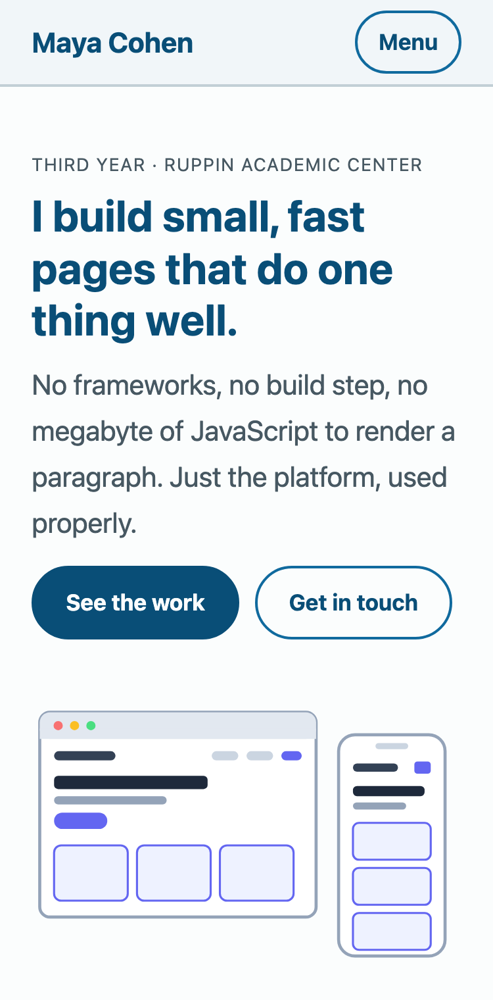

---
# The week number lives in the kicker and in `week:` (both print on every page).
# `--verify` finds the title with its digit in logical order (as in weeks 01–02).
title: העמוד מפסיק להיות ערימה — מטלת כיתה 4
kicker: שבוע 4 · פיתוח צד לקוח
week: 4
points: 100
deadline: לפני תחילת שיעור 5
duration: 30 דקות בכיתה (145–175), והשלמה בבית
weight: מטלת כיתה · 10 הטובות מתוך 12 נספרות
footer: פיתוח צד לקוח 2027 · המרכז האקדמי רופין
---

> [!goal]
> לבנות את עמוד הנחיתה של האתר שלך: **שורת ניווט שנסגרת בנייד, hero בשתי עמודות, ושורת
> כרטיסים שנערמת לבד.** הכול ב-Flexbox, בלי Grid, ועם שאילתת מדיה אחת בכל הקובץ — **וכל חלק
> ממנו כבר הקלדת היום פעם אחת, במחזור.**

בשבוע שעבר קיבלת שפה עיצובית. היא יפה, והיא עמודה אחת — כי זו הצורה היחידה שידעת לייצר.

השבוע העמוד מפסיק להיות ערימה. במחזורים של היום בנית שורת ניווט (מחזור 1), תג עם עוגן וכותרת
נעוצה (מחזור 2), שורת כרטיסים שגולשת לבד (מחזור 3) ותפריט שנסגר בטלפון (מחזור 5). המטלה היא
**הרכבה** של ארבעת אלה על הסימון של עמוד הנחיתה, ואז **הרחבה** — החבילות והגימורים. הקוד שכתבת
במחזורים נמצא ב-`live-code/<מחזור>/end/`, פתוח לידך; הוא לא הפתרון, הוא מה שהפתרון בנוי ממנו.

## תוצרי למידה

בסיום המטלה תדע:

1. להסביר למה עמוד נראה כפי שהוא נראה **לפני** שנגעת בו — זרימה רגילה, תיבות בלוק ותיבות שורה.
2. לבחור בין `display` ל-`position` ל-Flexbox לפי מה שאתה מנסה להשיג, ולא לפי מה שנזכרת בו.
3. לעגן אלמנט ממוקם לתיבה הנכונה, ולזהות מיד מתי שכחת.
4. לקרוא את הצירים של Flexbox ולדעת איזו תכונה פועלת על איזה ציר — **בלי לשנן**.
5. לבנות פריסה שמסתגלת לרוחב המסך כמעט בלי שאילתות מדיה.
6. לזהות את המלכודת של `min-width: auto` כשפריט מסרב להתכווץ.

## מה בדיוק אתה בונה

**עמוד חדש** — `week-04/index.html` — עמוד הנחיתה של אותו אתר אישי.

> [!note] ה-HTML מוכן, ואתה לא כותב אותו
> בתיקיית הפתיחה נמצא `index.html` **גמור**: שורת ניווט עם `details`, hero, שורת כרטיסים
> ושורת חבילות. שבועות 1–2 היו סימון ושבוע 3 היה טיפוגרפיה וצבע; **השבוע הוא פריסה**, ושלושים
> דקות בכיתה לא מספיקות גם להקליד עמוד וגם לפרוס אותו.
>
> כל מה שאתה נבדק עליו השבוע נמצא ב-`styles.css`. גם הוא מגיע חלקית מוכן: האיפוס, הטוקנים
> והשכבה הטיפוגרפית כבר שם. אתה כותב **רק את הפריסה**.

> [!note] ההקמה נעשתה בבית
> `week-04/` כבר במאגר שלך, עם `index.html`, `styles.css` ו-`images/` מתיקיית הפתיחה, ודחוף —
> זה `pre-class/README-he.md`, ו-`pre-class/verify.mjs` הדפיס לך "4/4 — מוכן". אם לא עשית את זה: חמש
> דקות עכשיו, לפי אותו קובץ, ואז המטלה. זמן הכיתה מתחיל בפריסה.

## איך זה אמור להיראות בסוף

זהו פתרון לדוגמה. **אותו HTML בדיוק** שאתה מקבל, ועוד קובץ CSS אחד.


ואותו עמוד ברוחב 375 — הניווט נסגר לכפתור, וכשלוחצים עליו הוא נפתח **מעל** התוכן ולא דוחף אותו:




> [!note]
> **אל תנסה להעתיק את הצבע שלי.** בקובץ יש שורה אחת, `--hue-brand`, ואני מבקש ממך לשנות
> אותה. מה שנבדק הוא איפה התיבות נוחתות, לא באיזה גוון. אבל ניגודיות כן נבדקת: אחרי שהחלפת
> גוון, בדוק קישור על רקע כרטיס ועל רקע הפוטר בבורר הצבע של Chrome (שבוע 3, מחזור 3) — צריך
> 4.5 לפחות. בגוונים כתומים, צהובים, ירוקים ותכלת (בערך 25 עד 205) זה לא יעבור כמו שהוא: הורד
> את הבהירות של `--color-accent` (המספר השלישי, 42%) עד שזה עובר — בערך 26% עד 36%.

## המשימה, שלב אחר שלב

כל שלב מציין באיזה מחזור בנית אותו היום. פתח את `end/` של אותו מחזור ליד הקובץ שלך — לא כדי
להעתיק (שמות המחלקות שונים בכוונה), אלא כדי לזכור מה הקלדת ולמה.

1. **שורת הניווט — הבר עצמו** {core} · *מחזור 1*
   ל-`.site-nav` יש שני ילדים: המותג והתפריט. שים אותם על שורה אחת, יישר אותם אנכית זה מול
   זה, ודחוף אותם לקצוות. שלוש הצהרות — אותן שלוש שהפכו את `Studio North` לשורת ניווט.

   איך אתה מפריד ביניהם — `justify-content: space-between` או `margin` אוטומטי על אחד מהם —
   **הוא שיקול שלך ולא נבדק.** שניהם נכונים. במחזור עשית את השני; הרמזים מסבירים מתי כל אחד
   נקרא טוב יותר.

2. **שורת הניווט — רשימת הקישורים** {core} · *מחזור 1*
   `.nav-links` היא `ul`. היא מגיעה עם תבליטים, ריפוד פנימי גדול ופריטים נערמים — שלושתם
   עיצוב של רשימה ולא פריסה, וצריך להסיר אותם לפני ש-`display: flex` שווה משהו. ראית את זה
   קורה בצעד 4 של המחזור: `display: flex` לבד לא נגע בהם.

   את המרווח בין הפריטים תן ב-`gap`, לא ב-`margin`.

3. **הדפוס לנייד — ושאילתת המדיה היחידה שלך** {core} · *מחזור 5*
   `details` מסתיר את כל תוכנו חוץ מה-`summary` עד שפותחים אותו. בנייד זה בדיוק מה שרוצים;
   במסך רחב זה בדיוק מה שלא רוצים.

   **Flexbox לא יכול לפתור את זה.** Flexbox מסדר את התיבות שנתנו לו; אין לו דעה על רוחב
   המסך ואין לו דרך לשאול. זו השאלה היחידה השבוע ששייכת לשאילתת מדיה, ולכן מותרת לך **אחת,
   כאן, ובשום מקום אחר בקובץ**:

   ```css
   @media (min-width: 48em) {
     /* מעל הסף: הפקד נעלם, והקישורים מוצגים כשורה בקצה הבר */
   }
   ```

   > [!note] שתי שורות בבלוק הזה כבר כתובות עבורך
   > `details` סגור מדווח **רוחב אפס**, ודפדפנים עדכניים לא **מציירים** את תוכנו. שתי
   > העקיפות האלה כתובות בתיקיית הפתיחה ומסומנות `given`, והקלדת אותן בעצמך בצעד 2 של מחזור 5 —
   > אז אתה יודע למה כל אחת שם. הן אינן פריסה, אינך נבדק עליהן, ואל תמחק אותן.

   והלוח שנפתח **מעל** התוכן ולא דוחף אותו — זה צעד 4 של אותו מחזור: השכבה. השימוש הנכון היחיד
   ב-`position` בכל הבר.

4. **ה-hero** {core} · *מחזור 3, עם שני פריטים במקום שלושה*
   טקסט בצד אחד, איור בשני, ושניהם ממורכזים אנכית זה מול זה — הדבר שקשה באמת בזרימה רגילה
   וקל כאן.

   ואז החלק שכולם שוכחים: ברוחב 375 אין מקום לשתי עמודות. **תן להן לגלוש.** `flex-wrap`
   ועוד `flex-basis` הגיוני על הטקסט הם כל התשובה, ואין בה שאילתת מדיה.

   שים לב לאיור. `img` בשורת flex נמתחת על ידי ברירת המחדל `align-items: stretch`.

5. **שורת הכרטיסים** {core} · *מחזור 3*
   שלושה זה לצד זה כשיש מקום, זה מתחת לזה כשאין, ושום דבר שבור באמצע. בדיוק שורת ה-`Field notes`
   של המחזור — עם הכתובת הארוכה ו-`min-width: 0` שלמדת שם.

   הדרישה במדויק: **ברוחב 1280 שלושה בשורה, ברוחב 375 נערמים.** מה קורה ב-768 הוא החלטת
   עיצוב שלך — שניים ואז אחד, או שלושה — ושתיהן מתקבלות, כל עוד שום דבר לא גולש.

   שני דברים שכדאי לשים לב אליהם:
   - הכרטיסים יוצאים **בגובה אחיד** למרות שהטקסט בהם שונה. אתה מקבל את זה בחינם. שים לב שכן.
   - כרטיס לא אמור להתכווץ לכלום. `flex-basis` אומר מאיפה הוא מתחיל, `flex-wrap` מחליט מתי
     הוא מוותר. מי שכתב `width: 33.333%` בצעד 1 של המחזור ראה מה קורה ב-375.

   **בלי שאילתת מדיה כאן.** אם כתבת אחת, לא הבנת את `flex-wrap`.

6. **שורת החבילות** {stretch} · *ה-"אתה עושה" של מחזור 3*
   אותה צורה כמו שורת הכרטיסים, עם דרישה אחת נוספת שהופכת אותה לשווה את הזמן: כל החבילות
   באותו גובה, **והכפתורים מיושרים לקצה התחתון** — למרות שבחבילה האמצעית ארבע שורות ובשאר שלוש.

   זה מכל flex בתוך פריט flex: השורה מסדרת את החבילות, וכל חבילה מסדרת את תוכנה כעמודה. ואז
   `margin` אוטומטי אחד עושה את השאר — אותו רעיון שדחף את הקישורים לקצה במחזור 1, בציר השני.

   `.plan--featured` היא האמצעית. תן לה להיראות נבחרת — **בלי להוציא אותה מהשורה.**

7. **הגימורים** {challenge} · *מחזור 2*
   ארבעה דברים קטנים, כל אחד מהם צעד שהקלדת היום:

   - **נעץ את הכותרת** כך שתישאר גלויה בזמן גלילה. הצהרה אחת והיסט אחד (צעד 4).
   - **שים את `.card-badge` על הפינה העליונה (למעלה, ימין או שמאל) של הכרטיס הראשון.** את הכלל `.card-badge` אתה כותב: `position: absolute`
     והיסטים לפינה. הוא מתייחס לאב הקרוב שהוא `position: relative` — כלומר צריך לומר לכרטיס להיות
     העוגן שלו, אחרת התג ינחת במקום שלא התכוונת. זה בדיוק מה שעשית ל-`.pill` במחזור 2 (צעדים 1–3),
     ו-`offsetParent` בקונסול אומר לך מי מעגן אותו.
   - **ודא שהכותרת הנעוצה נמצאת מעל התוכן** כשהם נפגשים. אם הניסיון הראשון לא עובד — אל
     תעלה את המספר. תסתכל מה עוד שמת על האבות (צעד 6).
   - **קישורי הפוטר (`.footer-links`) הם שורה שיודעת לגלוש** — אותו דפוס כמו רשימת הניווט
     (מחזור 1, צעד 8). הסעיף הזה בודק גם שאין שגיאות בקונסול ושאין הפרות של axe בעמוד כולו,
     כולל ניגודיות.

> [!constraints]
> - **אסור Grid.** `display: grid` הוא שבוע 5. השבוע הוא מימד אחד, והנקודה היא ללמוד מה
>   פריסה חד-ממדית יכולה ומה לא — לפני שמקבלים את הדו-ממדית.
> - **אסור `float` לפריסה.** הוא ארכיאולוגיה, וראינו היום למה.
> - **אסור `position` לפריסה.** `position` הוא בסילבוס השבוע, אבל ככלי לשים תג על כרטיס
>   ולנעוץ כותרת — לא כדי למקם עמודות.
> - **שאילתת רוחב אחת בכל הקובץ**, זו של סעיף 3. ה-hero, הכרטיסים והחבילות חייבים להסתדר
>   בלעדיה. אם אתה מושיט יד לשנייה — פספסת משהו ש-`flex-wrap` היה עושה בשבילך.
> - **אסור `!important`.** הוא לא תיקון.
> - **אסור `style=""` בתוך ה-HTML**, ואסור תגית `style`.
> - **אל תשנה את מבנה ה-HTML.** מותר להוסיף מחלקה אם באמת צריך; אסור לעטוף דברים ב-`div`
>   כדי לגרום ל-CSS לעבוד. **בפתרון שלי לא נוספה ולו עטיפה אחת** — הרץ `diff` ותראה.

## פירוט הניקוד

| רכיב | מה נבדק | ניקוד | סוג בדיקה |
|---|---|---|---|
| גליון חיצוני | קיים והגיע עם כללים בפנים | 3 | אוטומטי |
| שורת הניווט — הבר | שורה, מיושרת אנכית, המותג והתפריט בקצוות | 7 | אוטומטי |
| שורת הניווט — הקישורים | שורה, בלי תבליטים, עם `gap` | 6 | אוטומטי |
| הדפוס לנייד | פקד ב-375 בלי קישורים · קישורים ב-1280 בלי פקד | 8 | אוטומטי |
| ה-hero | שתי עמודות ב-1280, אחת ב-375, עם `flex-wrap` | 8 | אוטומטי |
| שורת הכרטיסים | שורה אחת ב-1280, שלוש ב-375, בלי גלילה אופקית | 10 | אוטומטי |
| גובה אחיד | כרטיסים שחולקים שורה באותו גובה | 4 | אוטומטי |
| המגבלות | בלי Grid, בלי float, בלי important, שאילתה אחת, בלי סימוני ליבה | 6 | אוטומטי |
| איכות הפריסה | קצב, יישור, נשימה וגימור | 10 | ידני |
| איכות הגליון | קריא, בלי חזרות, בלי עטיפות מיותרות | 5 | ידני |
| היגיינת קומיטים | הודעות בעלות משמעות, בלי קבצים מיותרים | 3 | ידני |
| שורת החבילות | שורה אחת ב-1280, נערמת ב-375 | 7 | אוטומטי |
| גובה אחיד בחבילות | חבילות שחולקות שורה באותו גובה | 4 | אוטומטי |
| כפתורים מיושרים | הקצה התחתון של כל הכפתורים באותו קו | 6 | אוטומטי |
| החבילה המומלצת | נבדלת ויזואלית ועדיין בשורה | 3 | אוטומטי |
| כותרת נעוצה | נשארת בראש המסך אחרי גלילה | 4 | אוטומטי |
| התג | `absolute`, ומעוגן לכרטיס ולא לעמוד | 4 | אוטומטי |
| קישורי הפוטר | שורה שיודעת לגלוש, בלי שגיאות קונסול ובלי כשלי נגישות | 2 | אוטומטי |

ליבה 70 · הרחבה 20 · אתגר 10. הליבה היא הרכבה של ארבעת המחזורים ואמורה להיגמר בתוך שלושים
הדקות בכיתה; ההרחבה והאתגר — בבית, לפני המועד.

**הבדיקות האוטומטיות רצות גם אצלך.** בכל דחיפה למאגר תרוץ בדיקה שמדווחת בעברית מה עבר ומה
לא, והיא מריצה רק את שכבת הליבה. **ירוק זה הרצפה, לא הציון** — הנקודות מגיעות מהחלקים
שמכונה לא יכולה לשפוט.

> [!ai-policy]
> **שבועות 1–5 — מורה פרטי.** מותר לבקש מ-Claude הסבר על צירים, על הקשרי ערימה או על
> `flex-basis`, ומותר לבקש ביקורת על CSS שכתבת. **אסור להעתיק ממנו קוד. אתה מקליד כל תו.**
>
> השבוע יש לזה סיבה חדה במיוחד: **כלֵי AI מעתיקים את הדיאלקט של ה-CSS שהדבקת, ופונים להרגלים
> ישנים** — float ו-clearfix, שלוש שאילתות `max-width` — וכל אחד מהם עובר ברוחב שהסתכלת בו
> ונשבר ברוחב שלא. תקבל פתרון שנראה נכון ופוסל את הסעיף.
>
> במחזור 4 היום ראית בדיוק את זה קורה: בקשה תמימה החזירה float ו-31 % — נכון ב-1280, שבור
> ב-375. מה שלמדת שם הוא איך לשאול ואיך לבדוק, לא איך להדביק.
>
> **אם אינך יכול להסביר שורה — היא לא שלך.** בשבוע 13 תשב מול הפרויקט הזה בלי אינטרנט
> ובלי AI.
>
> אין לך מנוי? הכול עובד גם בצ'אט החינמי, ואין בכך שום חיסרון בקורס.

> [!submission]
> הגשה במודל: **כתובת ה-repo ומזהה הקומיט (SHA)**, שניהם. ה-SHA הוא מה שמקפיא את ההגשה —
> דחיפות אחרי המועד לא משנות את מה שנבדק.
>
> ```bash
> git log -1 --format=%H
> ```
>
> **הגשה מאוחרת:** ההגשה נסגרת במועד שכתוב במודל. הגשה שמגיעה אחרי המועד מתקבלת
> ונבדקת במלואה, ומסומנת כמאוחרת — היא אינה מורידה נקודות.

## בדיקה עצמית

לפני שאתה מגיש, פתח את העמוד וּודא שכל אחד מאלה **קורה** — לא שכתבת אותו:

- הצרת את החלון עד 375 והכרטיסים נערמו אחד מתחת לשני **בלי שנגעת בכלום**.
- הרחבת חזרה ל-1280 והם חזרו לשורה, בגובה אחיד.
- ברוחב 375 יש כפתור תפריט ואין קישורים; לחצת עליו והם נפתחו **מעל** התוכן — העמוד מתחת
  לא זז.
- ברוחב 1280 יש קישורים ואין כפתור תפריט.
- גללת את העמוד לרוחב בשלושת הרוחבים ואין פס גלילה אופקי באף אחד מהם.
- חיפשת `grid` בקובץ ולא מצאת. חיפשת `float` ולא מצאת. חיפשת `!important` ולא מצאת.
- ספרת את שאילתות הרוחב (`min-width` / `max-width`) בקובץ. **יש אחת.** (`prefers-reduced-motion` ניתנת לך ואינה נספרת.)
- מחקת את `styles.css` לרגע והעמוד קרס לערימה — כלומר כל הפריסה באמת בגליון.
- כל סימון `CODE HERE` של הליבה חייב להיעלם; סימון שבשורה שלו כתוב גם שם השכבה בסוגריים מסולסלים (`stretch`, `challenge` או `optional`) מותר להשאיר אם דילגת על החלק הזה.
- עברת על העמוד עם Tab בלבד: הגעת לכל קישור, ראית איפה הפוקוס, והסדר היה הגיוני.

> [!note]
> נתקעת? קודם `live-code/<מחזור>/end/` של המחזור שהשלב מציין — הקוד שהקלדת היום. אחר כך
> `hints-he.md` — תשעה קשיים, שלוש רמות רמזים לכל אחד. פתח את הרמה הבאה רק אחרי שניסית באמת
> חמש דקות. ואם אתה רוצה לתרגל את Flexbox עד שהשמות מפסיקים לדרוש חיפוש — **Flexbox Froggy**,
> עשרים דקות, חינם.
>
> **דק הייחוס** (`deck-reference.pdf`) הוא עומק אופציונלי ואינו נבחן: כל ערכי `position`, מה יוצר
> הקשר ערימה, כל תכונות Flexbox, וההדגמות שמאחורי המחזורים.
