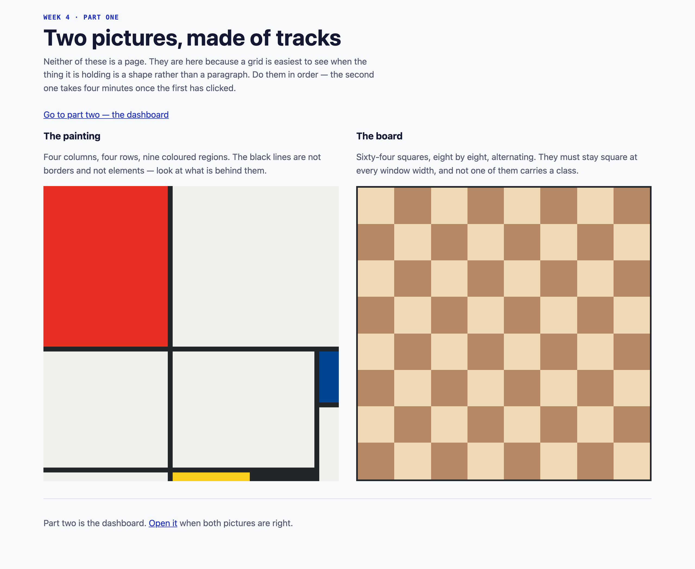
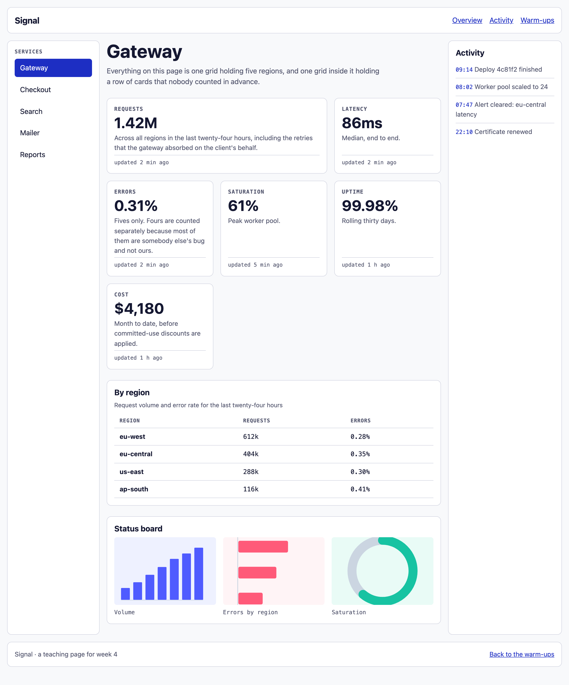
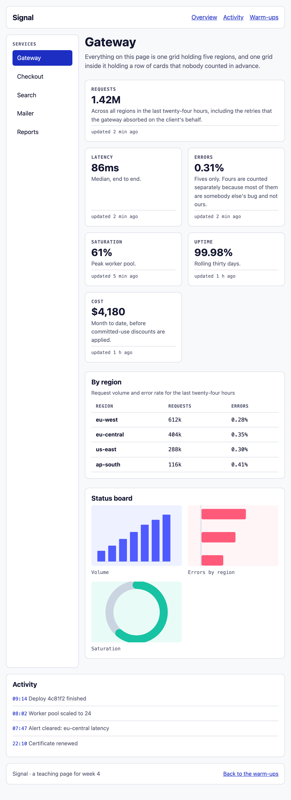

---
# Hebrew letters and spaces only in `title` — a digit or a comma inside a Hebrew run
# comes back from pdftotext wrapped in BiDi control marks and --verify cannot find it.
# The week number lives in the kicker. See COURSE_STATE.md.
title: הפריסה מקבלת ממד שני
kicker: שבוע 4 · פיתוח צד לקוח
week: 4
points: 100
deadline: לפני תחילת שיעור 5
duration: 90 דקות
weight: מטלת כיתה · 10 הטובות מתוך 12 נספרות
footer: פיתוח צד לקוח 2027 · המרכז האקדמי רופין
---

> [!goal]
> לבנות **שתי תמונות מתוך מסלולים** ואז **לוח מחוונים שנפרס אחרת בשלושה רוחבים** — הכול
> ב-Grid, mobile-first, ובלי שאילתת `max-width` אחת בכל הקובץ.

בשבוע שעבר העמוד הפסיק להיות ערימה. קיבלת ציר אחד, ולמדת לשלוט בו.

ואז נגמר לך הציר. אמרתי לך בסוף השיעור שיש דבר אחד ש-Flexbox לא יעשה בשבילך — פריסה
ששורות **ועמודות** שלה צריכות להתיישר זו מול זו — ושבוע 4 קיים בשבילו. הערב פורעים את
החוב הזה.

## תוצרי למידה

בסיום המטלה תדע:

1. להגדיר מסלולים מפורשים ולקרוא את מה שהדפדפן **באמת** פתר אותם אליו.
2. להסביר למה `fr` הוא לא אחוז, ולמה זה משנה ברגע שיש `gap`.
3. לבחור בין `auto-fit` ל-`auto-fill` ולנמק את הבחירה במשפט אחד.
4. למקם פריטים לפי קווים, כולל קווים שליליים, ולפרוס עמוד שלם עם אזורים בשמות.
5. **להכריע בין Grid ל-Flexbox לפי מה שאתה מנסה להשיג**, ולא לפי מה שנזכרת בו.
6. לבנות mobile-first ולהסביר למה `min-width` מצטבר ו-`max-width` נלחם.
7. לבחור נקודות שבירה **מהתוכן** ולא מרשימת מכשירים.

## מה בדיוק אתה בונה

**שני עמודים** בתיקייה `week-04/`, ושניהם חולקים גיליון סגנון אחד:

| קובץ | מה זה |
|---|---|
| `warmup.html` | שתי תמונות — ציור ולוח שחמט. חימום, ונבדק |
| `index.html` | לוח מחוונים שנפרס אחרת בשלושה רוחבים |
| `styles.css` | הקובץ היחיד שאתה כותב בו |

> [!note] ה-HTML מוכן, ואתה לא כותב אותו
> בתיקיית הפתיחה נמצאים שני העמודים **גמורים**: סמנטיים, תקינים, עם מחלקה לכל דבר שתצטרך.
> אל תשנה אותם. כל העבודה שלך בקובץ אחד — `styles.css` — ובכל מקום שבו אתה כותב משהו יש
> סימון `CODE HERE`. **כשלא נשארו סימונים מעל שכבת ההרחבה, סיימת את הליבה.**

## איך זה אמור להיראות בסוף








> [!note] הצבע שלך, לא שלי
> בראש `styles.css` יש `--hue-brand`. שנה את המספר הזה והעמוד כולו משנה גוון. **בחירת
> הגוון אינה נבדקת השבוע** — היא נבדקה בשבוע שעבר. שנה אותו בכל זאת.

## המשימה, שלב אחר שלב

### 1. הציור {core}

ארבע עמודות, ארבע שורות, תשעה אזורים צבעוניים.

התרגיל המקורי נתן את המידות בפיקסלים על בד של 748 על 748:

```
columns   320  198  153  50          gap  9px
rows      414  130  155  22
```

**אלה הפרופורציות, לא התשובה.** ציור שכתוב בפיקסלים קיים בגודל אחד בדיוק. שלך צריך להיות
אותו ציור גם בנייד — כלומר המסלולים הם שברים, ו-`fr` מקבל כל מספר ולא רק 1.

שמור עליו ריבועי **בלי לכתוב ולו גובה אחד**.

הקווים השחורים אינם גבולות ואין להם אלמנט משלהם. תסתכל מה יש **מאחורי** ה-`gap`.

### 2. הלוח {core}

שמונה עמודות, שישים וארבע משבצות, ואף מחלקה אחת ב-HTML.

המשבצות חייבות להישאר **ריבועיות בכל רוחב** — הפתרון הישן כתב `width: 100px; height: 100px`,
וזה ריבוע בגודל חלון אחד ומלבנים בכל השאר.

> [!note] נסה קודם את הדרך הלא נכונה
> `:nth-child(odd)` **לא עובד כאן**, וזה שווה עשר שניות לראות בעיניים. תקבל פסים אנכיים,
> כי בלוח ברוחב **זוגי** כל שורה מתחילה באותה זוגיות כמו זו שמעליה.
>
> תחשוב כמה משבצות לוקח לחזור לנקודת ההתחלה. זה לא 2 וזה לא 8.

### 3. שלד העמוד {core}

**זה הלב של השבוע.** חמישה אזורים, שלושה סידורים, והכול שלוש תמונות.

הסתכל בשלוש תמונות המטרה לפי הסדר: 375, ואז 768, ואז 1280. שים לב שאלה **אותם חמישה
אזורים** בכל פעם — שום דבר לא מופיע ושום דבר לא נעלם. רק הסידור משתנה.

1. **הבסיס.** בלי שאילתת מדיה בכלל. עמודה אחת, חמש שורות, כל אחת עם שם.
2. **האזורים עצמם.** כל אזור תובע **שם** ולא מספר קו. זה מה שהופך את שני הסעיפים הבאים
   לשלוש שורות כל אחד במקום שלושים.
3. **נקודת השבירה הראשונה.** שתי עמודות.
4. **נקודת השבירה השנייה.** שלוש עמודות.

> [!note] איפה שמים את נקודות השבירה
> לא ברוחב של טלפון, ולא ב-768 כי טבלה באינטרנט אמרה. **הצר את החלון, ואז הרחב לאט עד
> שהפריסה מתחילה לבזבז מקום או שהטקסט נהיה רחב מדי לקריאה — שם.** המספר יהיה שלך ולא של
> מכשיר כלשהו. שתי נקודות שבירה מספיקות, וכדאי לכתוב אותן ב-`em`.

### 4. שורת הכרטיסים {core}

שישה כרטיסים היום. היא צריכה לעבוד עם ארבעה, או תשעה, או אחד — **ובלי שאילתת מדיה**.

לספירת המסלולים יש מילת מפתח שאומרת "כמה שנכנסים". **יש שתיים כאלה והן לא אותו דבר.**
בחר את זו שגורמת לשורה קצרה של כרטיסים למלא את הרוחב במקום להשאיר מסלולים ריקים עומדים,
ותהיה מוכן לנמק במשפט אחד.

והכרטיס עצמו הוא **רכיב, לא עמוד**: ציר אחד, דברים בערימה, והשורה האפורה הקטנה חייבת
לשבת בתחתית כל כרטיס גם כשהטקסטים מעליה באורכים שונים. זה Flexbox, וזה בדיוק אותו תרגיל
מהשבוע שעבר.

### 5. לוח הסטטוס {stretch}

שלוש תמונות בשלוש צורות שונות. כרגע הגבוהה מותחת את כל השורה.

**שתי תכונות, שני תפקידים**, וזה הזוג הכי מבולבל בשבוע כולו: אחת קובעת כמה גדולה **התיבה**
(ומזמינה אותה עוד לפני שהתמונה הגיעה, מה שמונע קפיצה של העמוד), והשנייה קובעת מה קורה
**לתמונה** בתוך תיבה בצורה לא נכונה. צריך את שתיהן.

### 6. טיפוגרפיה זורמת וליטוש {stretch}

המספר הגדול בכרטיס צריך לזרום עם רוחב המסך, כמו ש-`h1` בסעיף 2 כבר עושה. **תשאיר איבר
`rem` בארגומנט האמצעי** — ערך מועדף שעשוי רק מ-`vw` מתעלם לגמרי מהגדרת גודל הגופן של
הקורא, וזו כשלוֹן נגישות ולא עניין של טעם.

ותן לכרטיסים מצב `hover` שמרים אותם קצת, ולקישורים מעבר צבע.

### 7. שני אתגרים {challenge}

**7.1 — כרטיס רחב בלי חור אחריו.** הכרטיס הראשון נפרס על שני מסלולים, אבל רק כשיש יותר
ממסלול אחד לפרוס עליו. זה משאיר חור, ויש ערך של `grid-auto-flow` שמרשה לכרטיס מאוחר לטפס
אחורה לתוכו.

יש לזה **מחיר אמיתי**: הוא משנה את הסדר הוויזואלי בלי לגעת ב-DOM, אז מה שרואים ומה שעוברים
עליו ב-Tab מפסיקים להתאים. כתוב הערה של שורה אחת שמסבירה למה זה מקובל **כאן**. בטופס זה
לא היה מקובל, וההבדל הוא המיומנות עצמה.

**7.2 — שורות שמתיישרות לרוחב כל השורה.** `subgrid` גורם לכרטיס לקחת את השורות שלו מהשורה
שהוא יושב בה במקום מהתוכן שלו. עטוף ב-`@supports`, כך שדפדפן בלעדיו נשאר עם גרסת ה-Flexbox
שלך — שהיא כבר טובה.

> [!constraints]
> - **בלי `@media (max-width: …)`.** כל שאילתת רוחב בקובץ היא `min-width`. שאילתה אחת
>   בכיוון הלא נכון מפילה את הסעיף גם אם העמוד נראה מושלם.
> - **בלי גובה קבוע** על אזור פריסה. אזור גבוה כמו מה שיש בתוכו.
> - בלי Tailwind. זה שבוע 5.
> - בלי JavaScript. שום דבר בעמוד הזה לא צריך אותו.
> - **בלי `transition` על `width`, `height`, `top`, `left`, `margin` או `padding`** — ובלי
>   `transition: all`. מותר `transform`, `opacity`, צבע וצל.
> - בלי `!important`. אם נדרש, סלקטור למעלה שגוי.
> - אל תיגע בשני קבצי ה-HTML.

## פירוט הניקוד

| רכיב | מה נבדק | ניקוד | סוג בדיקה |
|---|---|---|---|
| גיליון סגנון מקושר | הקובץ נטען בפועל | 3 | אוטומטי |
| הציור — פרופורציות | ארבע על ארבע, ריבועי, ביחסים המקוריים, ב-375 וב-1280 | 6 | אוטומטי |
| הציור — אזורים | תשעה אזורים מכסים את כל התאים, בצבעים הנכונים | 5 | אוטומטי |
| הלוח | שמונה עמודות, משבצות ריבועיות, צבעים שמתחלפים גם בין שורות | 6 | אוטומטי |
| שלד — Grid ואזורים | חמישה שמות, וכל אזור תובע שם | 5 | אוטומטי |
| שלד — שלושה סידורים | עמודה אחת ב-375, שלוש ב-1280, חמישה אזורים בכולם | 11 | אוטומטי |
| mobile-first | כל שאילתות הרוחב min-width, ולפחות שתי נקודות שבירה | 6 | אוטומטי |
| שורת הכרטיסים | משנה מספר עמודות לבד, בלי שאילתת מדיה | 6 | אוטומטי |
| מגבלות | בלי גובה קבוע, בלי `!important`, בלי סימונים, HTML תקין | 4 | אוטומטי |
| איכות הפריסה | קצב, יישור, נשימה, גימור | 10 | ידני |
| איכות הקוד | **Grid לעמוד, Flex לרכיבים**, קריאוּת, הערות | 5 | ידני |
| היגיינת Git | הודעות, קומיטים קטנים, בלי קבצים מיותרים | 3 | ידני |
| שורת התמונות | מתפרסת לבד | 5 | אוטומטי |
| התמונות | יחס אחיד, ולא מעוכות | 8 | אוטומטי |
| טיפוגרפיה זורמת | המספר בכרטיס משתנה בין 375 ל-1280 | 3 | אוטומטי |
| תנועה זולה | יש מעברים, וכולם על תכונות שלא מאלצות פריסה | 4 | אוטומטי |
| כרטיס רחב | רחב מהשאר ב-1280, כמו כולם ב-375 | 4 | אוטומטי |
| מילוי החור | `grid-auto-flow` צפוף | 3 | אוטומטי |
| subgrid והיגיינה | תחת `@supports`, אפס שגיאות קונסול, אפס הפרות נגישות | 3 | אוטומטי |

ליבה 70 · הרחבה 20 · אתגר 10.

בתיקייה שלך יש `.checks` שרץ אצלך בכל דחיפה ובודק את **שכבת הליבה בלבד**. אפשר להריץ אותו
גם מקומית:

```bash
node .checks/run-checks.mjs
```

**ירוק זה הרצפה, לא הציון.** הוא מוכיח שהדבר רץ. הנקודות מגיעות מהחלקים שמכונה לא יכולה
לשפוט.

> [!ai-policy]
> **שבוע 4 — Claude במצב מורה.** מותר לבקש ממנו להסביר, לצייר, ולבדוק את מה שכתבת. אתה
> מקליד כל תו בעצמך.
>
> שאלה טובה לשבוע הזה: *"תסביר לי למה `1fr` גולש כשיש בתוכו מחרוזת ארוכה"*. שאלה פחות
> טובה: *"תכתוב לי את הפריסה"*.
>
> ושים לב — AI נוטה לכתוב `@media (max-width: 768px)`, כי רוב הקוד באינטרנט נכתב כך.
> **זה בדיוק מה שאסור השבוע.** אם הוא מציע לך את זה, זו הזדמנות טובה לבדוק שהבנת למה.

> [!submission]
> דחוף לענף `main` במאגר הפרטי שלך, ואז הגש ב-Moodle **את כתובת המאגר ואת ה-SHA של
> הקומיט**. ה-SHA הוא מה שמקפיא את ההגשה.
>
> ```bash
> git log -1 --format=%H
> ```
>
> **הגשה מאוחרת:** ההגשה נסגרת במועד שכתוב במודל. הגשה שמגיעה אחרי המועד מתקבלת
> ונבדקת במלואה, ומסומנת כמאוחרת — היא אינה מורידה נקודות.

## בדיקה עצמית

- העמוד נפתח ב-Live Server ולא בלחיצה כפולה.
- לא נשאר אף `CODE HERE` מעל שכבת ההרחבה.
- הצרתי את החלון עד 375 והרחבתי עד 1280 **לאט**, ואין רגע שבו משהו קופץ או נחתך.
- אין פס גלילה אופקי באף רוחב.
- חיפשתי `max-width` בקובץ ולא מצאתי אף אחד.
- הציור נשאר ריבועי ובאותן פרופורציות גם ברוחב נייד.
- המשבצות בלוח ריבועיות, והצבע מתחלף גם כשעוברים שורה.
- לחצתי Tab לאורך כל העמוד וראיתי איפה הפוקוס נמצא בכל רגע.
- הקונסול נקי.
- `node .checks/run-checks.mjs` עובר.

> [!note] אם נתקעת
> `hints-he.md` בתיקייה, שלוש רמות לכל קושי. פתח את הרמה הבאה רק אחרי חמש דקות אמיתיות.
> וההדגמות מהשיעור נמצאות אצלך ב-`demos/` — במיוחד `04-auto-fit-fill` ו-`02-tracks`,
> שהן כלי עבודה ולא רק תצוגה.
