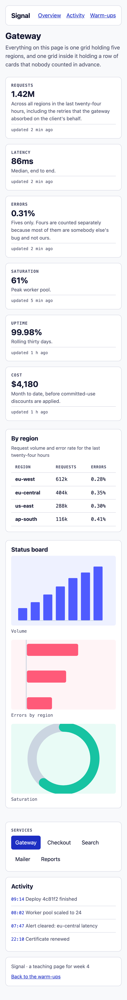

---
# The week number lives in the kicker and in `week:` (both print on every page).
# `--verify` finds the title with its digit in logical order (as in weeks 01–04).
title: הפריסה מקבלת ממד שני — מטלת כיתה 5
kicker: שבוע 5 · פיתוח צד לקוח
week: 5
points: 100
deadline: לפני תחילת שיעור 6
duration: 30 דקות בכיתה (145–175), והשלמה בבית
weight: מטלת כיתה · 10 הטובות מתוך 12 נספרות
footer: פיתוח צד לקוח 2027 · המרכז האקדמי רופין
---

> [!goal]
> לבנות **שתי תמונות מתוך מסלולים** ואז **לוח מחוונים שנפרס אחרת בשלושה רוחבים** — הכול
> ב-Grid, mobile-first, ובלי שאילתת `max-width` אחת בכל הקובץ — **וכל חלק ממנו כבר הקלדת היום
> פעם אחת, במחזור.**

בשבוע שעבר קיבלת ציר אחד ושאילתת `min-width` אחת. אמרתי לך בסוף השיעור שיש דבר אחד ש-Flexbox
לא יעשה בשבילך — פריסה ששורות **ועמודות** שלה צריכות להתיישר זו מול זו. היום פרענו את החוב.

במחזורים של היום בנית שלד של חמישה אזורים עם מסלולים ורצפה (מחזור 1), פוסטר מסקיצה ורצפת משבצות
(מחזור 2), שורת כרטיסים ושורת עטיפות שלא צריכות שאילתה (מחזור 3), ואת אותו שלד מחדש — ציור של
שמות, מהטלפון כלפי מעלה (מחזור 5). השקופית של מחזור 4 נתנה לך את הכלל: נקודת שבירה באה מהתוכן, ובודקים אותה
בגרירה. המטלה היא **הרכבה** של אלה על לוח המחוונים ועל עמוד החימומים, ואז **הרחבה** — התמונות,
הליטוש והאתגר. הקוד שכתבת במחזורים נמצא ב-`live-code/<מחזור>/end/`, פתוח לידך; הוא לא הפתרון,
הוא מה שהפתרון בנוי ממנו.

## תוצרי למידה

בסיום המטלה תדע:

1. להגדיר מסלולים מפורשים ולקרוא את מה שהדפדפן **באמת** פתר אותם אליו — בתג ה-`grid` של DevTools.
2. להסביר למה `fr` הוא לא אחוז, ולמה זה משנה ברגע שיש `gap`.
3. לבחור בין `auto-fit` ל-`auto-fill` ולנמק את הבחירה במשפט אחד.
4. למקם פריטים לפי קווים, כולל קווים שליליים, ולפרוס עמוד שלם עם אזורים בשמות.
5. **להכריע בין Grid ל-Flexbox לפי מה שאתה מנסה להשיג**, ולא לפי מה שנזכרת בו.
6. לבנות mobile-first ולהסביר למה `min-width` מצטבר ו-`max-width` נלחם.
7. לבחור נקודות שבירה **מהתוכן** ולא מרשימת מכשירים — ולבדוק אותן בגרירה.

## מה בדיוק אתה בונה

**שני עמודים** בתיקייה `week-05/`, ושניהם חולקים גיליון סגנון אחד:

| קובץ | מה זה |
|---|---|
| `warmup.html` | שתי תמונות — ציור ולוח שחמט. חימום, ונבדק |
| `index.html` | לוח מחוונים שנפרס אחרת בשלושה רוחבים |
| `styles.css` | הקובץ היחיד שאתה כותב בו |

> [!note] ה-HTML מוכן, ואתה לא כותב אותו
> בתיקיית הפתיחה נמצאים שני העמודים **גמורים**: סמנטיים, תקינים, עם מחלקה לכל דבר שתצטרך.
> אל תשנה אותם. כל העבודה שלך בקובץ אחד — `styles.css` — ובכל מקום שבו אתה כותב משהו יש
> סימון `CODE HERE`. **כשלא נשארו סימוני ליבה, סיימת את הליבה.** כל סימון `CODE HERE` של הליבה חייב להיעלם; סימון שבשורה שלו כתוב גם שם השכבה בסוגריים מסולסלים (`stretch`, `challenge` או `optional`) מותר להשאיר אם דילגת על החלק הזה.

> [!note] ההקמה נעשתה בבית
> `week-05/` כבר במאגר שלך, עם שני העמודים, `styles.css` ו-`images/` מתיקיית הפתיחה, ודחוף —
> זה `pre-class/README-he.md`, ו-`pre-class/verify.mjs` הדפיס לך "4/4 — מוכן". אם לא עשית את זה:
> חמש דקות עכשיו, לפי אותו קובץ, ואז המטלה.

## איך זה אמור להיראות בסוף




> [!note] הצבע שלך, לא שלי
> בראש `styles.css` יש `--hue-brand`. שנה את המספר הזה והעמוד כולו משנה גוון. **בחירת
> הגוון אינה נבדקת השבוע** — היא נבדקה בשבוע 3. שנה אותו בכל זאת. אבל ניגודיות כן
> נבדקת (axe, בשורה "subgrid והיגיינה" בטבלת הניקוד): אחרי שהחלפת גוון, בדוק קישור על רקע
> כרטיס ועל רקע העמוד בבורר הצבע של Chrome (שבוע 3, מחזור 3) — צריך 4.5 לפחות. בגוונים
> כתומים, צהובים, ירוקים ותכלת (בערך 20 עד 205) זה לא יעבור כמו שהוא: הורד את הבהירות של
> `--color-accent` (המספר השלישי, 44%) עד שזה עובר — בערך 26% עד 38%, ונמוך יותר ככל
> שהגוון קרוב לצהוב-ירוק.

## המשימה, שלב אחר שלב

### 1. הציור {core}

**הרכבה של מחזור 2**, בגדול יותר: ארבע עמודות, ארבע שורות, תשעה אזורים צבעוניים.

התרגיל המקורי נתן את המידות בפיקסלים על בד של 748 על 748:

```
columns   320  198  153  50          gap  9px
rows      414  130  155  22
```

**אלה הפרופורציות, לא התשובה** — בדיוק כמו הסקיצה של הפוסטר במחזור 2. ציור שכתוב בפיקסלים
קיים בגודל אחד; שלך צריך להיות אותו ציור גם בנייד, ו-`fr` מקבל כל מספר ולא רק 1.

שמור עליו ריבועי **בלי לכתוב ולו גובה אחד** — ראית ב-375 מה `height` עושה לריבוע.

הקווים השחורים אינם גבולות ואין להם אלמנט משלהם. תסתכל מה יש **מאחורי** ה-`gap`.

### 2. הלוח {core}

**הרחבה של מחזור 2:** שמונה עמודות, שישים וארבע משבצות, ואף מחלקה אחת ב-HTML.

המשבצות חייבות להישאר **ריבועיות בכל רוחב** — הפתרון הישן כתב `width: 100px; height: 100px`,
וזה ריבוע בגודל חלון אחד ומלבנים בכל השאר.

> [!note] נסה קודם את הדרך הלא נכונה
> `:nth-child(odd)` **לא עובד כאן**, בדיוק כמו ברצפה של מחזור 2 — פסים אנכיים, כי בלוח ברוחב
> **זוגי** כל שורה מתחילה באותה זוגיות כמו זו שמעליה.
>
> תחשוב כמה משבצות לוקח לחזור לנקודת ההתחלה. ברצפה ברוחב 4 זה היה 8. כאן זה לא 2 וזה לא 8.

### 3. שלד העמוד {core}

**זה הלב של השבוע, והרכבה של מחזורים 1 ו-5.** חמישה אזורים, שלושה סידורים, והכול שלוש תמונות.

הסתכל בשלוש תמונות המטרה לפי הסדר: 375, ואז 768, ואז 1280. שים לב שאלה **אותם חמישה
אזורים** בכל פעם — שום דבר לא מופיע ושום דבר לא נעלם. רק הסידור משתנה.

1. **הבסיס.** בלי שאילתת מדיה בכלל. עמודה אחת, חמש שורות, כל אחת עם שם.
2. **האזורים עצמם.** כל אזור תובע **שם** ולא מספר קו. זה מה שהופך את שני הסעיפים הבאים
   לשלוש שורות כל אחד במקום שלושים.
3. **נקודת השבירה הראשונה.** שתי עמודות.
4. **נקודת השבירה השנייה.** שלוש עמודות.

> [!note] איפה שמים את נקודות השבירה
> לא ברוחב של טלפון, ולא ב-768 כי טבלה באינטרנט אמרה — נקודת שבירה באה מהתוכן, לא מטבלת
> מכשירים. **הצר את החלון, ואז הרחב לאט עד שהפריסה מתחילה לבזבז מקום או
> שהטקסט נהיה רחב מדי לקריאה — שם.** שתי נקודות שבירה מספיקות, וכדאי לכתוב אותן ב-`em`.
> הגבול היחיד הוא תמונות המטרה עצמן: הבודק מודד שתי עמודות לפחות ב-768 ושלוש ב-1280, אז
> נקודת השבירה הראשונה יושבת ב-48em או מתחת, והשנייה ב-80em או מתחת. בתוך זה — מהתוכן.

### 4. שורת הכרטיסים {core}

**הרכבה של מחזור 3.** שישה כרטיסים היום. השורה צריכה לעבוד עם ארבעה, או תשעה, או אחד — **ובלי
שאילתת מדיה**.

לספירת המסלולים יש מילת מפתח שאומרת "כמה שנכנסים". **יש שתיים כאלה והן לא אותו דבר** — מחזור 3,
צעדים 3 ו-4. בחר את זו שגורמת לשורה קצרה של כרטיסים למלא את הרוחב, ותהיה מוכן לנמק במשפט אחד.

והכרטיס עצמו הוא **רכיב, לא עמוד**: ציר אחד, דברים בערימה, והשורה האפורה הקטנה חייבת לשבת
בתחתית כל כרטיס גם כשהטקסטים מעליה באורכים שונים. הפנים של `.kpi` הוא Flexbox — בדיוק כמו
הכרטיסים של מחזור 3, ובדיוק כמו בשבוע 4. (החריג היחיד הוא אתגר 7.2: שם ה-subgrid מתווסף **בתוך `@supports`**, וגרסת
ה-Flexbox נשארת מחוצה לו.)

### 5. לוח הסטטוס {stretch}

**העטיפות של מחזור 3, ביחס אחר.** שלוש תמונות בשלוש צורות שונות, ועכשיו הגבוהה מותחת את כל השורה.

**שתי תכונות, שני תפקידים** — אחת קובעת כמה גדולה **התיבה** (ומזמינה אותה עוד לפני שהתמונה
הגיעה), והשנייה קובעת מה קורה **לתמונה** בתוך תיבה בצורה לא נכונה. צריך את שתיהן, והיחס כאן
הוא 3 : 2.

כמו שורת הכרטיסים, השורה נמדדת ב**עמודה אחת ב-375** ובכמה עמודות ב-1280. ב-375 השורה רחבה
בערך 19rem, אז רצפה של 10rem ומעלה נותנת שם עמודה אחת; רצפה קטנה בהרבה נותנת שתיים ומפילה את הסעיף.

### 6. טיפוגרפיה זורמת וליטוש {stretch}

**ה-you-do של מחזור 5, על המספר בכרטיס.** הוא צריך לזרום עם רוחב המסך, כמו ש-`h1` בסעיף 2 של
הגיליון כבר עושה. **תשאיר איבר `rem` בארגומנט האמצעי** — ערך מועדף שעשוי רק מ-`vw` מתעלם מהגדרת
גודל הגופן של הקורא, וזו כשלוֹן נגישות ולא עניין של טעם.

ותן לכרטיסים מצב `hover` שמרים אותם קצת — ב-`transform` — ולקישורים מעבר צבע. צבע לא מזיז פריסה,
אבל הדפדפן צובע אותו מחדש בכל פריים — ל-hover קצר על קישור זה בסדר, רק לא בחינם.

### 7. שני אתגרים {challenge}

את האתגר משלימים **בבית, לפני שיעור 6**, ושני החלקים שלו נמצאים בספיין של השבוע: שקופית 31
(w05-grid-declare) ושקופית 32 (w05-subgrid-one-slide), שמוצגות לכל הכיתה בתחילת חלון המטלה.

**7.1 — כרטיס רחב בלי חור אחריו.** הכרטיס הראשון נפרס על שני מסלולים, אבל רק כשיש יותר ממסלול
אחד לפרוס עליו (ספירה של מסלולים ולא קו — כמו השמיים במחזור 2, צעד 4). זה עלול להשאיר חור, ויש ערך של `grid-auto-flow` שמרשה לכרטיס מאוחר לטפס אחורה
לתוכו (שקופית "The grid you did not declare").

יש לזה **מחיר אמיתי**: הוא משנה את הסדר הוויזואלי בלי לגעת ב-DOM, אז מה שרואים ומה שעוברים
עליו ב-Tab מפסיקים להתאים. כתוב הערה של שורה אחת שמסבירה למה זה מקובל **כאן**. בטופס זה
לא היה מקובל, וההבדל הוא המיומנות עצמה.

**7.2 — שורות שמתיישרות לרוחב כל השורה.** `subgrid` גורם לכרטיס לקחת את השורות שלו מהשורה
שהוא יושב בה במקום מהתוכן שלו. עטוף ב-`@supports`, כך שדפדפן בלעדיו נשאר עם גרסת ה-Flexbox
שלך — שהיא כבר טובה (שקופית "subgrid, in one slide").

> [!constraints]
> - **בלי `@media (max-width: …)`.** כל שאילתת רוחב בקובץ היא `min-width`. שאילתה אחת
>   בכיוון הלא נכון מפילה את הסעיף גם אם העמוד נראה מושלם.
> - **בלי גובה קבוע** על אזור פריסה. אזור גבוה כמו מה שיש בתוכו, או כמו היחס שלו.
> - **בלי גלילה אופקית** ב-375, ב-768 וב-1280. הבודק מודד את זה בשלושת הרוחבים.
> - **HTML תקין** — הבודק מריץ html-validate. בדוק בעצמך: `npx html-validate@9 index.html warmup.html`.
> - בלי Tailwind. זה שבוע 6.
> - בלי JavaScript. שום דבר בעמוד הזה לא צריך אותו.
> - **בלי `transition` על `width`, `height`, `top`, `left`, `margin` או `padding`** — ובלי
>   `transition: all` (וגם משך בלי תכונה: `transition: 200ms` הוא `all 200ms`). `transform`
>   ו-`opacity` עדיפים — ה-compositor מזיז שכבה בלי פריסה.
>   צבע וצל מותרים: הם לא מזיזים פריסה, אבל נצבעים מחדש בכל פריים — בסדר ל-hover קצר.
>   נופלים תמיד: `all` שכתוב במפורש, `transition` עם משך ובלי תכונה, ותכונה שמאלצת פריסה — בכל תנאי ובכל מצב, חוץ מבתוך `@media (prefers-reduced-motion: reduce)` עם משך של 10ms ומטה, שזה כיבוי תנועה; צורה שהבודק לא יכול להכריע בוודאות (למשל `var()` עם יותר מדי צירופים) מקבלת את הספק לטובתך, ועשויה להיבדק ידנית.
> - בלי `!important`. אם נדרש, סלקטור למעלה שגוי.
> - אל תיגע בשני קבצי ה-HTML.

## פירוט הניקוד

| רכיב | מה נבדק | ניקוד | סוג בדיקה |
|---|---|---|---|
| גיליון סגנון מקושר | הקובץ נטען בפועל | 3 | אוטומטי |
| הציור — פרופורציות | ארבע על ארבע, ריבועי, ביחסים המקוריים, ב-375 וב-1280 | 6 | אוטומטי |
| הציור — אזורים | תשעה אזורים מכסים את כל התאים, בצבעים הנכונים | 5 | אוטומטי |
| הלוח | שמונה עמודות, משבצות ריבועיות, צבעים שמתחלפים גם בין שורות | 6 | אוטומטי |
| שלד — Grid ואזורים | חמישה שמות, וכל אזור תובע שם | 5 | אוטומטי |
| שלד — שלושה סידורים | עמודה אחת ב-375, לפחות שתיים ב-768, שלוש ב-1280, חמישה אזורים בכולם | 11 | אוטומטי |
| mobile-first | כל שאילתות הרוחב min-width, ולפחות שתי נקודות שבירה | 6 | אוטומטי |
| שורת הכרטיסים | משנה מספר עמודות לבד, בלי שאילתת מדיה | 6 | אוטומטי |
| מגבלות | בלי גובה קבוע, בלי `!important`, בלי סימוני ליבה, בלי גלילה אופקית, HTML תקין לפי html-validate | 4 | אוטומטי |
| איכות הפריסה | קצב, יישור, נשימה, גימור | 10 | ידני |
| איכות הקוד | **Grid לעמוד, Flex לרכיבים**, קריאוּת, הערות | 5 | ידני |
| היגיינת Git | הודעות, קומיטים קטנים, בלי קבצים מיותרים | 3 | ידני |
| שורת התמונות | מתפרסת לבד — עמודה אחת ב-375, יותר ב-1280 | 5 | אוטומטי |
| התמונות | יחס אחיד, ולא מעוכות | 8 | אוטומטי |
| טיפוגרפיה זורמת | גודל המספר בכרטיס משתנה בין 375 ל-1280, בהפרש של 3px לפחות | 3 | אוטומטי |
| תנועה בלי פריסה | יש מעברים, וכולם על תכונות שלא מאלצות פריסה | 4 | אוטומטי |
| כרטיס רחב | רחב מהשאר ב-1280, כמו כולם ב-375 | 4 | אוטומטי |
| מילוי החור | `grid-auto-flow` צפוף | 3 | אוטומטי |
| subgrid והיגיינה | תחת `@supports`, אפס שגיאות קונסול, אפס הפרות נגישות | 3 | אוטומטי |

ליבה 70 · הרחבה 20 · אתגר 10.

בתיקייה שלך יש `.checks` שרץ אצלך בכל דחיפה ובודק את **שכבת הליבה בלבד**. אפשר להריץ אותו
גם מקומית:

```bash
node .checks/run-checks.mjs
```

**ירוק זה הרצפה, לא הציון.** הוא מוכיח שהדבר רץ. הנקודות מגיעות מהחלקים שמכונה לא יכולה
לשפוט.

> [!ai-policy]
> **שבועות 1–5 — מורה פרטי.** מותר לבקש מ-Claude להסביר, לצייר, ולבדוק את מה שכתבת. **אסור
> להעתיק ממנו קוד. אתה מקליד כל תו.**
>
> שאלה טובה לשבוע הזה: *"תסביר לי למה `1fr` גולש כשיש בתוכו מחרוזת ארוכה"*. שאלה פחות
> טובה: *"תכתוב לי את הפריסה"*.
>
> ראית במחזור 4 מה חוזר כשמבקשים כלל אצבע: משפט כללי שנשמע נכון ("`auto-fit` ממלא את השורה
> האחרונה") — ובעמוד שלך, במדידה, הוא נכון רק בקצה אחד. מה שלמדת שם הוא איך לבקש כלל אצבע
> ואיך לבדוק אותו בעמוד שלך, לא איך להדביק. ושים לב: כל
> שאילתת `max-width` בקובץ פוסלת את הסעיף `mobile-first`, גם אם הפריסה נראית נכונה.
>
> **אם אינך יכול להסביר שורה — היא לא שלך.** בשבוע 13 תשב מול הקוד שלך בלי אינטרנט ובלי AI.
>
> אין לך מנוי? הכול עובד גם בצ'אט החינמי, ואין בכך שום חיסרון בקורס.

> [!submission]
> דחוף לענף `main` במאגר הפרטי שלך, ואז הגש ב-Moodle **את כתובת המאגר ואת ה-SHA של
> הקומיט**. ה-SHA הוא מה שמקפיא את ההגשה.
>
> ```bash
> git log -1 --format=%H
> ```
>
> **הגשה מאוחרת:** הגשה באיחור אינה מותרת ללא אישור מראש בכתב. הגשה באיחור
> תגרור הפחתה בציון.

## בדיקה עצמית

- העמוד נפתח ב-Live Server ולא בלחיצה כפולה.
- כל סימון `CODE HERE` של הליבה חייב להיעלם; סימון שבשורה שלו כתוב גם שם השכבה בסוגריים מסולסלים (`stretch`, `challenge` או `optional`) מותר להשאיר אם דילגת על החלק הזה.
- הצרתי את החלון עד 375 והרחבתי עד 1280 **לאט** — גרירה, לא שלוש עצירות — ואין רגע שבו משהו
  קופץ, נחתך או נעלם מתחת לאזור אחר.
- אין פס גלילה אופקי באף רוחב.
- חיפשתי `max-width` בקובץ ולא מצאתי אף אחד בתוך `@media`.
- הציור נשאר ריבועי ובאותן פרופורציות גם ברוחב נייד, ואין בקובץ `height:` על אזור פריסה.
- המשבצות בלוח ריבועיות, והצבע מתחלף גם כשעוברים שורה.
- בתג ה-`grid` של DevTools ראיתי את הקווים של השלד בשלושת הרוחבים.
- לחצתי Tab לאורך כל העמוד וראיתי איפה הפוקוס נמצא בכל רגע.
- הקונסול נקי, ו-`npx html-validate@9 index.html warmup.html` לא מדפיס כלום.
- `node .checks/run-checks.mjs` עובר.

> [!note] אם נתקעת
> `hints-he.md` בתיקייה, שלוש רמות לכל קושי. פתח את הרמה הבאה רק אחרי חמש דקות אמיתיות.
> ו-`live-code/*/end/` מהשיעור — קוד שכבר הקלדת, ליד הקובץ שלך. ההדגמות ב-`demos/` — במיוחד
> `04-auto-fit-fill` ו-`02-tracks` — הן כלי עבודה ולא רק תצוגה.
