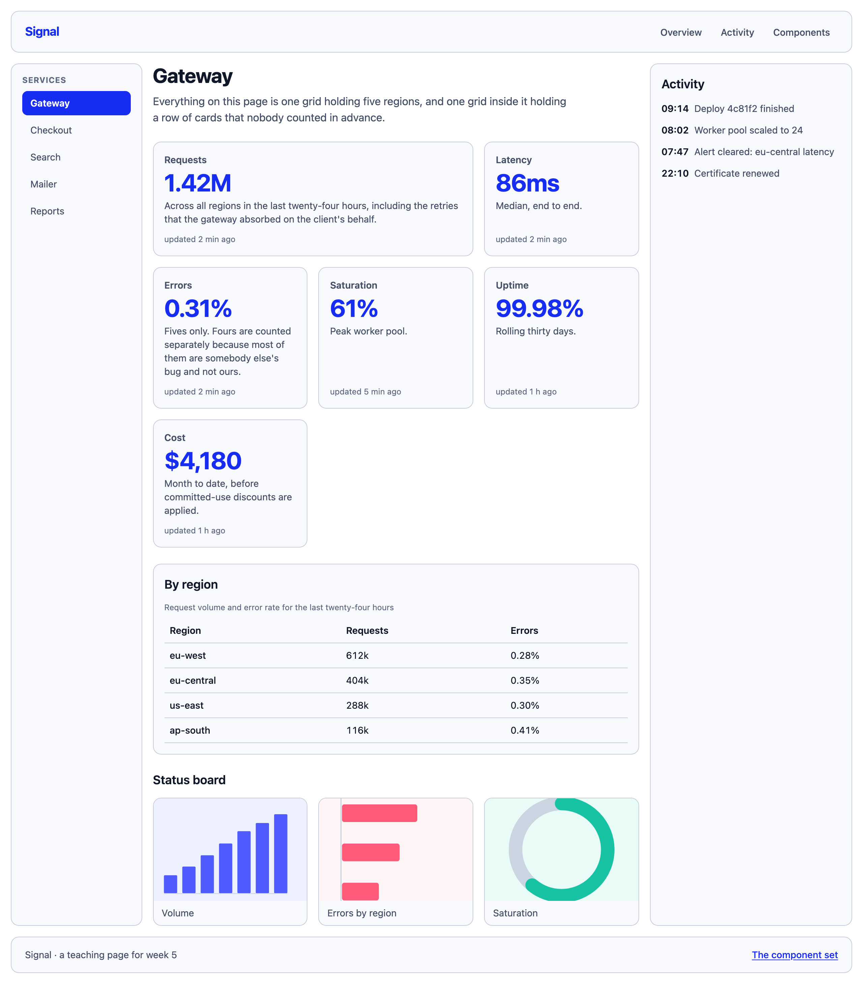
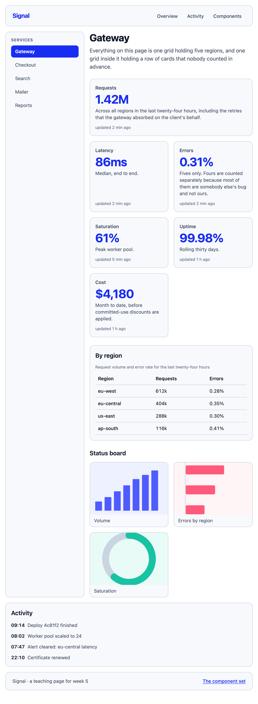
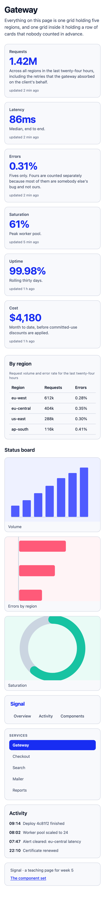
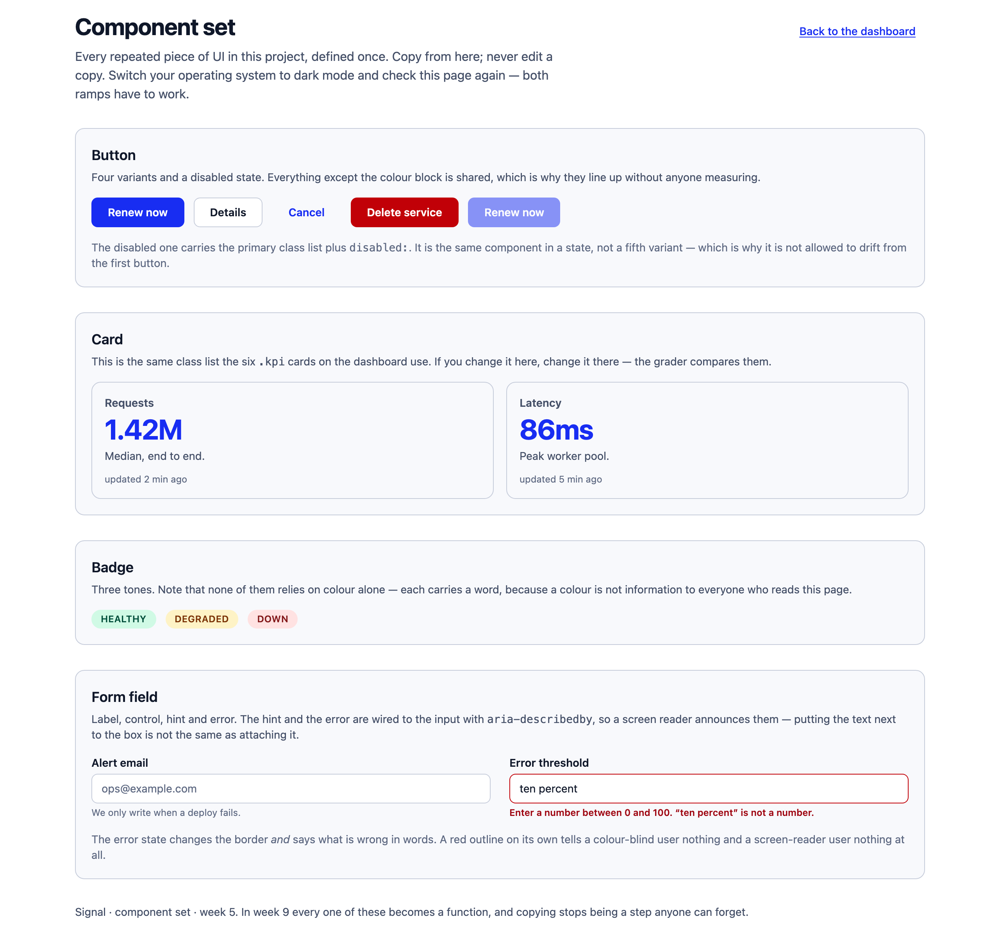

---
# Hebrew letters and spaces only in `title` — a digit or a comma inside a Hebrew run
# comes back from pdftotext wrapped in BiDi control marks and --verify cannot find it.
# The week number lives in the kicker. See COURSE_STATE.md.
title: העמוד נכתב במחלקות
kicker: שבוע 5 · פיתוח צד לקוח
week: 5
points: 100
deadline: לפני תחילת שיעור 6
duration: 90 דקות
weight: מטלת כיתה · 10 הטובות מתוך 12 נספרות
footer: פיתוח צד לקוח 2027 · המרכז האקדמי רופין
---

> [!goal]
> לבנות מחדש את לוח המחוונים של שבוע 4 **בלי גיליון סגנון בכלל**, ולהוסיף לו **סט רכיבים**
> שמוגדר במקום אחד ומועתק לכל השאר — הכול עם מצב כהה, ובלי לצאת מהסולם.

בשבוע שעבר כתבת 480 שורות CSS והן עבדו. השבוע אנחנו לא זורקים אותן — אנחנו **קוראים אותן
בקול**, ולכל שורה כותבים את המחלקה שמייצרת בדיוק אותה. זה כל השבוע. אין כאן שפה חדשה.

ואז, כשהתרגום נהיה משעמם, נגיע לשאלה האמיתית: מה קורה כשאותו כפתור מופיע בשישה מקומות.

## תוצרי למידה

בסיום המטלה תדע:

1. לתרגם כל הצהרת CSS שכתבת בשבועות 2–4 ל-utility, ולהפך — **בלי לשנן**.
2. להסביר למה utility אינו inline style, בארבע נקודות שאפשר להדגים.
3. להשתמש בסולם במקום במספרים, ולזהות מתי ערך בסוגריים מרובעים הוא נכון ומתי הוא ריח.
4. להגדיר טוקנים ב-`@theme` ולהבין שזה אותו `tokens.css` משבוע 2 עם תפקיד שני.
5. לבנות מצב כהה שעובר AA **בשני המצבים**, בלי JavaScript ובלי כפתור.
6. להגדיר רכיב **פעם אחת** ולהעתיק אותו — ולהסביר למה `@apply` אינו הפתרון לזה.
7. **לקרוא קוד שנכתב על ידי AI ולהחליט אם הוא נכון**, ולנמק בכתב את מה שדחית.

## מה בדיוק אתה בונה

**שלושה עמודים** בתיקייה `week-05/`, ואף אחד מהם לא מקושר לגיליון סגנון:

| קובץ | מה זה | שכבה |
|---|---|---|
| `index.html` | לוח המחוונים של שבוע 4, בנוי מחדש | ליבה |
| `components.html` | סט הרכיבים — המקור היחיד לכל דבר שחוזר | ליבה והרחבה |
| `variants/a,b,c.html` | שלוש תשובות של Claude לאותו עיצוב | הרחבה |
| `review-he.md` | גיליון הסקירה שאתה ממלא | הרחבה |
| `tindog.html` | TinDog, בנוי מחדש | אתגר |

> [!note] הסימון מוכן, והמחלקות הן העבודה
> בשבוע 4 ה-HTML היה גמור וכתבת CSS. השבוע זה בדיוק הפוך: ה-HTML גמור **והמחלקות הן
> המטלה**. בכל מקום שבו אתה כותב משהו יש `class="CODE-HERE"`. מחק את הסימון וכתוב במקומו.
>
> שמות כמו `layout`, `kpi`, `side-nav` שיושבים לצידו **אינם utilities ואינם עושים כלום** —
> הם שם כדי שתדע איזה אזור זה, וכדי שהבודק ימצא אותו. אל תיגע בהם.
>
> **כשלא נשארו סימוני `CODE-HERE` בשני עמודי הליבה, סיימת את הליבה.**

## איך זה אמור להיראות בסוף









## המשימה, שלב אחר שלב

### 1. הסביבה, ולמה היא מקומית {core}

בראש כל עמוד כבר יש:

```html
<script src="vendor/tailwind.js"></script>
```

**זה לא CDN, וזה בכוונה.** אותו קובץ בדיוק שה-CDN מגיש, רק שהוא יושב אצלך במאגר. הסיבה
היא שבוע 13: בבחינת הכירורגיה אין אינטרנט, והפרויקט שלך מעוצב ב-Tailwind. עמוד שהעיצוב שלו
מגיע מהרשת פשוט לא מרונדר שם. באינטרנט תראה את השורה עם כתובת מלאה — תזהה אותה, ותדע למה
אצלנו היא אחרת.

מתחתיו יש בלוק `@theme`, **והוא ניתן לך**. הוא `shared/tokens.css` של שבוע 2, מילה במילה:
אותו אינדיגו, אותם אפורים, אותו צעד של 0.25rem. ההבדל היחיד הוא שעכשיו כל שם בו מייצר גם
מחלקות — `--color-brand-500` נותן לך `bg-brand-500`, `text-brand-500`, `border-brand-500`.

**אל תערוך אותו, ואל תקליד אף קוד צבע.** לכל צבע שתצטרך כבר יש שם.

### 2. השלד {core}

**זה הלב של השבוע הראשון.** חמישה אזורים, שלושה סידורים.

בשבוע 4 מיקמת אותם לפי **שם** עם `grid-template-areas`. **ל-Tailwind אין utility לזה**, וזו
לא נסיגה — זו הזמנה להשתמש במערכת שכל כלי עיצוב בתעשייה מדבר בה: **שנים־עשר עמודות**.

```
                md      xl
  side-nav       4       2
  main           8       7
  activity      12       3
```

הכותרת העליונה והתחתונה לוקחות את כל השתים־עשרה בשני הרוחבים.

שלושת הרוחבים:

1. **הבסיס, בלי תחילית בכלל.** עמודה אחת. וב-375 **העמודה הראשית מופיעה לפני תפריט הצד** —
   יש utility אחת שעושה את זה.
2. **התחילית הראשונה.** תפריט הצד והראשית זה לצד זה.
3. **התחילית השנייה.** שלוש עמודות.

> [!note] המחיר של סידור מחדש, ואנחנו משלמים אותו בעיניים פקוחות
> ה-utility שמזיזה את העמודה הראשית קדימה משנה את הסדר **הוויזואלי** בלבד. סדר ה-DOM לא
> משתנה, ולכן מי שעובר ב-Tab יגיע קודם לתפריט הצד — בדיוק האזהרה משבוע 3 על `order`.
> זה מקובל **כאן**, כי מדובר בשני אזורי ניווט שכנים ולא בטופס. **בטופס זה לא היה מקובל.**

### 3. שורת הכרטיסים {core}

עמודה אחת בנייד, יותר מאחת במסך רחב.

בשבוע 4 המשימה הייתה לעשות את זה **בלי שאילתת מדיה** — ו-`repeat(auto-fit, minmax())` ידע.
השבוע התשובה האידיומטית היא שתי תחיליות, והיא דווקא טובה יותר: הן אותן שתי נקודות שבירה
שהשלד כבר משתמש בהן, כך שכל העמוד משנה צורה יחד במקום שהכרטיסים ינדדו בלוח זמנים משלהם.

### 4. מצבים {core}

לכל קישור בתפריט הצד צריך להיות:

- **מצב ריחוף** שמשנה משהו שרואים,
- **וסימן פוקוס** שמופיע כשמגיעים אליו במקלדת.

הריחוף הוא הקל. הפוקוס הוא זה שנבדק בכל מטלה מאז שבוע 1, והוא היחיד שאי אפשר להדגים בעכבר —
**תעבור על העמוד ב-Tab לפני שאתה מגיש.**

> [!note] וריאנט אחד נוסף שכדאי להכיר, והוא ניתן לך בכותרת העליונה
> `motion-safe:` מתקמפל ל-`@media (prefers-reduced-motion: no-preference)`. מעבר שנכתב
> `motion-safe:transition-colors` פשוט **לא קיים** למי שביקש ממערכת ההפעלה שלו להפסיק
> להזיז דברים — בלי `!important` ובלי לבטל כלום.
>
> זה הכלל של שבוע 2 פוגש את המנגנון של שבוע 5, וזו הדוגמה הנקייה ביותר במטלה לווריאנט
> שקורא **העדפה של משתמש** ולא רוחב מסך. **כל מעבר שאתה כותב השבוע צריך אותו.**

### 5. מצב כהה {core}

בלי כפתור. `dark:` הוא `@media (prefers-color-scheme: dark)` ותו לא, וכפתור דורש מאזין
לחיצה — כלומר JavaScript, כלומר שבוע 7. **החלף את מצב מערכת ההפעלה שלך** ובדוק ככה.

ארבעה דברים חייבים להשתנות: רקע העמוד, צבע הטקסט, רקע הכרטיס וצבע המספר הגדול. **ושני
המצבים חייבים לעבור 4.5:1.**

> [!note] מעלה־צבע כהה הוא לא היפוך
> שים לב שהטוקן של המותג עובר מ-`500` ל-`300` במצב הכהה. זה לא טעם — זה החישוב:
> `brand-500` על רקע כמעט־שחור נותן בערך 3:1, מה שחוקי לגבול ואסור למילה. **מעלה־צבע כהה
> הוא סט שני של החלטות תחת אותה מגבלה.**

### 6. סט הרכיבים {core}

`components.html` הוא **המקור היחיד** לכל דבר שחוזר. ארבע משפחות:

| רכיב | מה נדרש |
|---|---|
| כפתור | ראשי, משני, שקוף, מסוכן, ועוד אחד מושבת |
| כרטיס | **בדיוק אותה רשימת מחלקות** שששת הכרטיסים ב-`index.html` משתמשים בה |
| תג | שלושה גוונים, ואף אחד מהם לא מסתמך על צבע בלבד |
| שדה טופס | תווית, פקד, הסבר — ועוד אחד במצב שגיאה |

תכונות ה-`data-component` כבר בסימון. הן איך שהבודק מקבץ מופעים; אל תיגע בהן.

> [!note] מה בדיוק נמדד כאן
> הבודק לוקח **טביעת אצבע של הסגנון המחושב** של כל מופע של כל רכיב, ומפיל את הסעיף אם
> שניים לא מסכימים. הוא לא משווה מחרוזות מחלקות: שתי רשימות שונות שמרונדרות אותו דבר —
> עוברות. **העתק שאיבד מחלקה אחת — נופל, וגם אם על המסך זה נראה תקין.**
>
> וזה כולל בין עמודים: הכרטיס ב-`components.html` והכרטיס ב-`index.html` חייבים להיות זהים.

### 7. סקירת הקוד של ה-AI {stretch}

**זה הסעיף שהשבוע קיים בשבילו.** הכול כתוב ב-`review-he.md`, וזה מה שאתה עושה:

1. קרא את שלוש הגרסאות ב-`variants/`, **את הקוד לפני ההסבר**.
2. **מצא את זו שההסבר שלה לא מתאר את מה שהיא עושה, ותקן אותה בקובץ.**
3. מלא את שלושת הסעיפים — במה בחרת, מה היה שבור ואיך גילית, ולמה דחית את **הנכונה** שדחית.

הסעיף השלישי הוא הקשה, וזה בכוונה. "היא שגויה" זו סיבה קלה. "היא נכונה ובכל זאת לא בחרתי
בה" זה שיקול הנדסי, וזה מה שנבדק.

### 8. TinDog {challenge}

התרגיל מהקורס הישן, שנבנה שם ב-Bootstrap. התמונות המקוריות ב-`images/tindog/`.

שלושה דברים שהליבה לא מגיעה אליהם: **גיבור** בשתי עמודות עם צילום שאסור לו להתעוות,
**שורת לוגואים** בארבעה גדלים טבעיים שונים שצריכים להתיישר, ו**שימוש חוזר** — כל כפתור וכל
כרטיס בעמוד הזה חייבים להיות רשימת המחלקות מ-`components.html`, בלי שינוי. עמוד חדש הוא
בדיוק הרגע שבו מתחשק להקליד כפתור מהזיכרון.

> [!constraints]
> - **בלי גיליון סגנון משלך.** בלי `<link rel="stylesheet">`, בלי `<style>` נוסף,
>   בלי קובץ `.css`. הבלוק היחיד שמותר הוא `<style type="text/tailwindcss">` שכבר נמצא שם.
> - **בלי `style="…"`.** אם התחשק לך אחד — מצאת את השיעור של השבוע, תביא אותו למעבדה.
> - **בלי `!important`.**
> - **בלי `@apply`.** יש לזה שימוש אחד לגיטימי ואנחנו נראה אותו בשיעור; הוא לא כאן.
> - **הישאר על הסולם.** `p-4`, לא `p-[17px]`. סוגריים מרובעים **מותרים** — הם דלת מילוט
>   אמיתית — אבל רק כשלמערכת אין שם לערך שאתה צריך: רוחב המידה של הטקסט ב-`ch`, רשימת
>   מסלולים של `auto-fit`, מידה של נכס שמישהו אחר קבע. **המבחן:** האם הייתי רוצה שאלמנט
>   שני יקבל בדיוק את הערך הזה? אם כן — זו החלטה, ומקומה ב-`@theme`. אם הערך כבר נמצא
>   על הסולם או צעד ממנו — אתה דורס מערכת שעבדה, וזה הריח. ראה `demos/08-arbitrary/`.
> - בלי JavaScript. שום דבר בשלושת העמודים לא צריך אותו.
> - אל תיגע בסימון מלבד תכונות ה-`class`.

## פירוט הניקוד

| רכיב | מה נבדק | ניקוד | סוג בדיקה |
|---|---|---|---|
| Tailwind נטען | כללים נוצרים בפועל, ואין גיליון סגנון משלך | 3 | אוטומטי |
| שלד — שלושה סידורים | עמודה אחת ב-375 (ראשית לפני הצד), שתיים ב-768, שלוש ב-1280 | 11 | אוטומטי |
| שורת הכרטיסים | משנה מספר עמודות בין נייד למסך רחב | 6 | אוטומטי |
| טוקנים | הצבעים הצבועים מגיעים מ-`@theme` ולא מקודי צבע | 5 | אוטומטי |
| הסולם | כל המרווחים על הסולם, **ויש ריווח אמיתי** | 6 | אוטומטי |
| מצב כהה | ארבע תכונות משתנות, ושני המצבים עוברים AA | 8 | אוטומטי |
| מצבים | ריחוף אמיתי משנה משהו, ופוקוס נראה במקלדת | 7 | אוטומטי |
| מגבלות | בלי `style=`, בלי `!important`, בלי סימונים, HTML תקין | 6 | אוטומטי |
| איכות התוצאה | קצב, יישור, נשימה, גימור | 10 | ידני |
| **סקירת ה-AI — הכתוב** | זיהוי, איך התגלה, ונימוק דחייה שמצביע על קוד | 5 | ידני |
| היגיינת Git | הודעות, קומיטים קטנים, בלי קבצים מיותרים | 3 | ידני |
| סט הרכיבים | ארבע משפחות, כל מופע זהה לאחרים וגם בין עמודים | 8 | אוטומטי |
| **סקירת ה-AI — התיקון** | הגרסה השבורה מרונדרת נכון ב-375 וב-1280 | 7 | אוטומטי |
| שדה הטופס | תווית והסבר מקושרים, ומצב שגיאה במילים | 5 | אוטומטי |
| TinDog — גיבור | שתי עמודות שהופכות לאחת, תמונה לא מעוותת | 4 | אוטומטי |
| TinDog — שימוש חוזר | הכרטיסים והכפתור זהים להגדרה ב-`components.html` | 3 | אוטומטי |
| TinDog — ליטוש | לוגואים מיושרים ולא מעוותים, אפס שגיאות, אפס הפרות נגישות | 3 | אוטומטי |

ליבה 70 · הרחבה 20 · אתגר 10.

בתיקייה שלך יש `.checks` שרץ אצלך בכל דחיפה ובודק את **שכבת הליבה בלבד**. אפשר להריץ אותו
גם מקומית:

```bash
node .checks/run-checks.mjs
```

**ירוק זה הרצפה, לא הציון.** הוא מוכיח שהדבר רץ. הנקודות מגיעות מהחלקים שמכונה לא יכולה
לשפוט.

> [!ai-policy]
> **שבוע 5 — Claude עובר למצב עוזר. זה שינוי, וכדאי לעצור עליו רגע.**
>
> עד עכשיו: הוא מסביר ומצייר, אתה מקליד כל תו. **מהשבוע הוא רשאי לייצר קוד** — קטעים,
> רשימות מחלקות, גרסאות שלמות של רכיב.
>
> בתמורה, אתה אחראי על כל שורה שאתה מכניס. ואחריות היא לא הצהרה — היא יכולת:
>
> - **תוכל להסביר כל מחלקה שהכנסת**, ומה ה-CSS שהיא מייצרת. אם לא — היא לא נכנסת.
> - **תוכל לנמק למה דחית את מה שדחית.** זה סעיף 7, והוא נבדק בכתב.
>
> ובדיוק בגלל זה, סעיף 7 קיים: אחת משלוש התשובות שקיבלתי **לא עושה מה שההסבר שלה טוען**.
> ההסבר משכנע, מנוסח היטב, ומתאר קוד אחר. זה קורה, זה יקרה לך, וזו הסיבה שקריאה ביקורתית
> היא מיומנות נבדקת בקורס הזה ולא הערת שוליים.
>
> מותר לחלוטין להשתמש ב-Claude כדי לנתח את שלוש הגרסאות. מה שנבדק הוא שאתה מבין ויכול
> לעמוד מאחורי מה שכתבת.

> [!submission]
> דחוף לענף `main` במאגר הפרטי שלך, ואז הגש ב-Moodle **את כתובת המאגר ואת ה-SHA של
> הקומיט**. ה-SHA הוא מה שמקפיא את ההגשה.
>
> ```bash
> git log -1 --format=%H
> ```
>
> **הגשה מאוחרת:** ההגשה נסגרת במועד שכתוב במודל. הגשה שמגיעה אחרי המועד מתקבלת
> ונבדקת במלואה, ומסומנת כמאוחרת — היא אינה מורידה נקודות.

## בדיקה עצמית

- שלושת העמודים נפתחים ב-Live Server ולא בלחיצה כפולה.
- לא נשאר אף `CODE-HERE` ב-`index.html` וב-`components.html`.
- חיפשתי `<style` ו-`style=` בקבצים, והדבר היחיד שמצאתי הוא בלוק ה-`@theme` שקיבלתי.
- הצרתי את החלון עד 375 והרחבתי עד 1280 **לאט**, ואין רגע שבו משהו קופץ או נחתך.
- **החלפתי את מערכת ההפעלה שלי למצב כהה** וקראתי את שלושת העמודים ככה. הכול קריא.
- לחצתי Tab לאורך כל העמוד וראיתי איפה הפוקוס נמצא בכל רגע.
- ספרתי את הסוגריים המרובעים שלי והעברתי **כל אחד** במבחן: "הייתי רוצה שאלמנט שני יקבל
  בדיוק את הערך הזה?" — ואף אחד מהם אינו מרווח שנמצא צעד מהסולם.
- פתחתי את `variants/c.html` ברוחב 375 אחרי התיקון וראיתי **עמודה אחת**.
- שלושת הסעיפים ב-`review-he.md` מלאים, ואין בהם שדה `___` שנשאר ריק.
- הקונסול נקי.
- `node .checks/run-checks.mjs` עובר.

> [!note] אם נתקעת
> `hints-he.md` בתיקייה, שלוש רמות לכל קושי. פתח את הרמה הבאה רק אחרי חמש דקות אמיתיות.
>
> וההדגמות מהשיעור נמצאות אצלך ב-`demos/`. שתיים מהן הן כלי עבודה ולא תצוגה:
> **`03-translator`** מקבל הצהרת CSS ומחזיר את ה-utility על ידי מדידה, ו-**`04-scale`**
> מצייר את שלושת הסולמות בגודל אמיתי. מותר ורצוי להשתמש בהן תוך כדי.
