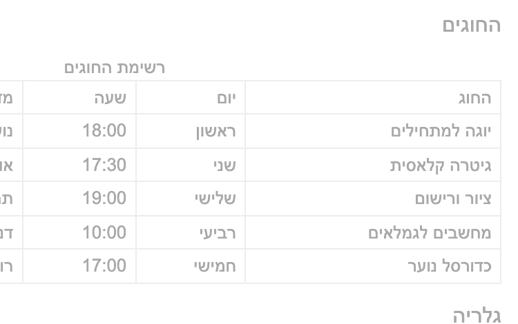

> [!goal]
> לבקר עמוד שעובר כל בדיקה אוטומטית שלמדת ואינו שמיש · לבנות מחדש חלק אחד ממנו · ולייצר
> את תוכנית הפרויקט שלך ולדחוף אותה.

שלושה חלקים, ושניים מהם שווים אותו דבר: **הביקורת 35, התוכנית 35, העיצוב מחדש 30.**
מי שמצא שישה עשר ליקויים ולא כתב תוכנית מקבל בדיוק כמו מי שעשה את ההפוך.

## תוצרי למידה

בסיום המטלה תדע:

1. לבקר עמוד לפי רשימת בדיקה בת ארבעים וחמש שורות, ולנמק כל ממצא במשפט שאפשר לפעול לפיו.
2. לדרג ממצאים לפי חומרה, ולהסביר למה תיקנת אחד לפני אחר.
3. לזהות את ארבעת המצבים בכל אזור שמציג נתונים, ולומר איזה מהם חסר.
4. לבנות מחדש אזור כך שיעבור AA, יעבוד במקלדת, ויעבוד ב-375.
5. **לייצר מסמך תכנון עם AI ולתקן את מה שהוא ניחש** — ולדעת מה בדיוק תיקנת.

---

## מה יש בתיקייה

| קובץ | מה עושים איתו |
|---|---|
| `bad-page.html` | **קוראים. לא נוגעים.** הבודק מאמת שהקובץ לא שונה |
| `audit-he.md` | ממלאים — זו הביקורת |
| `redesign.html` | בונים מחדש — אזור אחד, ב-Tailwind |
| `PROJECT_PLAN.md` | ממלאים בעזרת Claude, ואחר כך מתקנים |
| `images/` `vendor/` | נתונים. לא נוגעים |

**רשימת הבדיקה המודפסת** (`audit-checklist-he.md`) מחולקת בשיעור והיא הכלי לחלק א. אם אבדה —
היא בחומרי הקורס.

---

## העמוד שאתה מבקר

זה העמוד במסך רחב, והוא כבר מספיק כדי למצוא ארבעה או חמישה ליקויים בלי לפתוח שום כלי.
**עכשיו הסתכל על אותו עמוד בטלפון.**

**התמונה הבאה היא הליקוי, לא צילום כושל.** ברוחב 375 העמוד גולש 197 פיקסלים החוצה: מהטור
"מדריך" ומהטור "מקומות" נשארת אות אחת בקצה, ושאר הטבלה נמצא מחוץ למסך. זה מה שמשתמש רואה
לפני שהוא גולל לצדדים — והוא בדרך כלל לא גולל, הוא מניח שזה כל מה שיש.

פתח את `bad-page.html` בעצמך והקטן את החלון ל-375. תראה את אותו דבר, וזו שורה ז1 ברשימה.

> [!note]
> **אין כאן תמונה של "אחרי", וזה בכוונה.** לחלק ב יש יותר מתשובה נכונה אחת — טבלה שגוללת
> בתוך מכל משלה וכרטיסים שתיהן מקבלות ניקוד מלא — וצילום של הפתרון שלי היה הופך את
> ההחלטה הזאת להעתקה. **מה שנמדד הוא הדרישות שברשימה בחלק ב, לא דמיון לתמונה.**

---

## חלק א · ביקורת · 35 נקודות

מלא את `audit-he.md`. יש בו שבע קבוצות, בהתאמה לרשימת הבדיקה.

**מה נדרש בכל ממצא:**

| השדה | מה נכנס בו |
|---|---|
| מה מצאתי | תיאור **ספציפי**. לא "הצבעים חלשים" אלא "טקסט הגוף ב-2.3:1 מול הרקע" |
| החומרה | חמורה / בינונית / קלה |
| מה נשבר בפועל | מה המשתמש **לא יכול לעשות**. זו העמודה שמפרידה ביקורת מרשימת תלונות |
| השורה ברשימה | ג1, ה2, ד5 |
| התיקון | במשפט. לא קוד |

**דרישות מספריות:**

- **לפחות שנים עשר ממצאים**, מלפחות **חמש** מתוך שבע הקבוצות. יש שישה עשר ליקויים
  מכוונים בעמוד; שנים עשר זה הרף.
- **לפחות שלושה** מדורגים חמורים, **ולפחות שניים** קלים. ביקורת שכל שורה בה חמורה לא
  דירגה שום דבר.
- **שלוש שורות סיכום** בסוף: מה החמור ביותר ולמה · מה תתקן ראשון ולמה (זו לא בהכרח אותה
  תשובה) · **ומה בעמוד הזה עובד**.

> [!note]
> **השורה השלישית בסיכום נספרת.** גם לעמוד הגרוע ביותר יש החלטה אחת נכונה, ולמצוא אותה
> קשה יותר מלמצוא עשרה ליקויים. ביקורת שכולה "הכול רע" אינה ביקורת — היא התלהבות.

**שלוש שורות בלבד דורשות כלי:** ג1, ג2, ג3 (ניגודיות). כל השאר — עין, מקלדת, וחלון צר.
אם אתה פותח כלי לכל שורה, אתה עובד קשה מדי.

---

## חלק ב · עיצוב מחדש · 30 נקודות

`redesign.html` מכיל **אזור אחד** מהעמוד הרע: **רשימת החוגים**. הסימון הועתק כמו שהוא,
כולל הליקויים. יש שם `vendor/tailwind.js` ובלוק `@theme` **נתון ומלא** — לא צריך לבחור
צבעים, צריך להשתמש בהם.

בנה את האזור מחדש עם utilities. הסימנים `class="CODE-HERE"` הם המקומות שאתה כותב בהם;
**מחק את הסימן** כשסיימת.

**מה נדרש, וכל שורה נמדדת:**

| # | הדרישה | איך זה נמדד |
|---|---|---|
| 1 | כל טקסט עובר **4.5:1** | נמדד מהפיקסלים המרונדרים, בכל טקסט באזור |
| 2 | גבול של פקד עובר **3:1** | אם יש פקדים באזור |
| 3 | **היררכיה נראית** | הכותרת גדולה או כבדה יותר מהגוף באופן מדיד |
| 4 | הזמינות נושאת **טקסט**, לא רק צבע | הבודק מחפש טקסט לצד כל סימן זמינות |
| 5 | **375 בלי גלילה אופקית** | וגם 768 וגם 1280 |
| 6 | קיבוץ במרווח | יחס בין-שורות לתוך-שורה מעל 1.4 |
| 7 | הכול על הסולם | ריווח מסולם Tailwind, בלי ערכים בסוגריים מרובעים |
| 8 | טבעת פוקוס נראית | על כל דבר שאפשר להגיע אליו ב-Tab |
| 9 | `alt` שאומר משהו | או `alt=""` לתמונה שלא מוסיפה |
| 10 | סדר כותרות תקין | ו-`h1` אחד בעמוד |

**אסור:** JavaScript · ערכים בסוגריים מרובעים (`p-[13px]`) · `!important` ·
`outline: none` בלי חלופה נראית · לשנות את `@theme`.

> [!constraints]
> **אין JavaScript השבוע.** ניהול פוקוס, תזמון ולידציה ומצבי טעינה הם דברים שאתה יודע
> עכשיו **לזהות ולבקר**; לבנות אותם זה שבועות 7 ו-8. אם הפתרון שלך דורש מאזין, בחרת
> בפתרון של שבוע אחר.

**טיפ שחוסך חצי שעה:** אל תתחיל מלמחוק. קרא את הסימון פעם אחת, החלט מה **המבנה** הנכון
(טבלה? רשימה? כרטיסים?) ואז בנה. טבלה עם רוחב קבוע לא נהיית רספונסיבית בתיקון של
`width`.

---

## חלק ג · תוכנית הפרויקט · 35 נקודות

**היום אתה סוגר נושא.** לא בשבוע הבא.

1. בחר נושא מ-`project-topics-he.md` — 22 נושאים מאושרים, לכל אחד שדות ישות, API שנבדק,
   והסיכון שמפיל אותו. **או** הצע נושא משלך, ואשר אותו איתי **בשיעור הזה**.
2. פתח שיחה חדשה ב-Claude. **הדבק את `PROJECT_PLAN.md` כולו, כולל ההערות** — הן הנחיות
   גם לו.
3. תאר את הנושא בשלוש-ארבע שורות. **אל תבקש קוד.**
4. בקש ממנו למלא את התבנית, **ולסמן במפורש כל מקום שבו ניחש** במקומך.
5. עבור סעיף-סעיף ותקן. **הוא יטעה** — ראה למטה.
6. `git add` · `git commit` · `git push`.

**מה נדרש מהתוכנית:**

- כל עשרת הסעיפים מלאים. **סעיף ריק הוא סעיף חסר**, גם אם התשובה "אין".
- סעיף 3 (האוסף): **ישות אחת**, עם שמות שדות באנגלית וטיפוסים. שדה שאפשר שיהיה חסר הוא
  `| null`.
- סעיף 5 (ה-API): כתובת מדויקת עם פרמטרים, **ואיך בדקת** שהיא עובדת מהדפדפן.
- סעיף 6 (ארבעת המצבים): **בטקסט שיופיע על המסך בפועל.** "הודעת שגיאה מתאימה" אינו מצב.
- סעיף 8: **"לא אבנה" לא ריק.** זה הסעיף שמאפשר לך לומר לא לעצמך בשבוע 10.
- **סעיף הביקורת שלך**: שלוש שורות בסוף המסמך — מה הוא ניחש, מה תיקנת, ולמה.

> [!note]
> **הוא יטעה בשלושה דברים, ואלה הם.** ראיתי את שלושתם השבוע:
> **ישות גדולה מדי** (הוא ייתן לך שלוש ויקרא לזה אחת) · **מצב חסר** (הוא יכתוב ריק,
> נטען והצלחה וישכח ש"עוד לא חיפשת" ו"לא נמצא" הם שני מצבים ריקים שונים) ·
> **API שדורש מפתח** (הוא ימציא נקודת קצה שנשמעת נכונה לגמרי).
> למצוא אותם זה חלק מהציון, לא הסתייגות בסוף.

---

> [!ai-policy]
> **שבוע 6 — AI כעוזר.** מותר לו להסביר, להציע ולנסח. בחלק ג הוא **מייצר** את הטיוטה,
> וזה בדיוק מה שנדרש — התוצר הוא מסמך, לא קוד.
>
> **בחלק א ובחלק ב אתה כותב.** מותר לשאול אותו "למה 4.5:1 ולא 3:1" ומותר לבקש שיסביר
> `:focus-visible`. **אסור** להדביק לו את העמוד הרע ולבקש רשימת ליקויים — זו המטלה
> עצמה, וזו גם המחשה טובה למה: הרשימה שלו תהיה גנרית, בלי חומרה ובלי "מה נשבר בפועל",
> כלומר בלי שני השדות שהניקוד יושב עליהם.
>
> **בלי מנוי?** הכול כאן עובד ב-Claude חינמי בדפדפן. אין בחלק ג שום שלב שדורש
> Claude Code — זה טקסט, והדבקה של טקסט עובדת בכל מקום. אף אחד לא נחסם.

---

## איך אני יודע שסיימתי

- [ ] `audit-he.md` — שנים עשר ממצאים לפחות, מחמש קבוצות, עם חומרה בכל אחד
- [ ] שלוש שורות הסיכום מלאות, **כולל מה שעובד**
- [ ] `bad-page.html` — **לא נגעתי בו** (`git status` שקט לגביו)
- [ ] `redesign.html` — אין `CODE-HERE`, אין JavaScript, אין ערכים בסוגריים
- [ ] הקטנתי את החלון ל-375: אין גלילה אופקית
- [ ] לחצתי Tab על האזור החדש: רואים איפה הפוקוס, בכל עצירה
- [ ] הזמינות נקראת גם בשחור-לבן
- [ ] `PROJECT_PLAN.md` — עשרה סעיפים, ובסוף מה שתיקנתי לו
- [ ] **יש לי נושא, והוא מאושר**
- [ ] commit עם הודעה שאומרת משהו, ו-push

## נקודות

| חלק | נק׳ | אוטומטי | ידני |
|---|---|---|---|
| א · ביקורת | 35 | 12 | 23 |
| ב · עיצוב מחדש | 30 | 26 | 4 |
| ג · תוכנית | 35 | 14 | 21 |
| **סה״כ** | **100** | **52** | **48** |

היחס הידני הוא הגבוה בקורס עד כה, וזה נכון: מכונה יכולה לבדוק שיש שנים עשר ממצאים,
לא שהם נכונים.

> [!submission]
> **Moodle · לפני תחילת שיעור 7 · כתובת הריפו + SHA של הקומיט.**
> העבודה בתיקייה `week-06/` בריפו הסמסטריאלי שלך. `PROJECT_PLAN.md` — גם ב-`week-06/`
> וגם, בהמשך, ב-`project/`; בשבוע הזה מספיק אחד מהם.
>
> **הגשה מאוחרת:** ההגשה נסגרת במועד שכתוב במודל. הגשה שמגיעה אחרי המועד מתקבלת
> ונבדקת במלואה, ומסומנת כמאוחרת — היא אינה מורידה נקודות.
